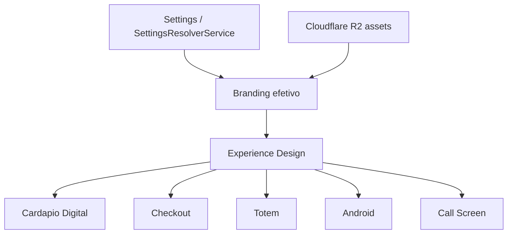

# Experience Design

Version: 1.0.0

Status: PROPOSED_BASELINE

Owner: Product + Frontend + Backend

Last Updated: 2026-07-14

Este documento define a camada de experiencia visual da Defumar. Ele nao altera contratos, nao cria endpoints e nao substitui Settings. Ele orienta como Cardapio Digital, Checkout, Totem, Android, Evento Publico, Call Screen e canais futuros devem compartilhar a mesma linguagem visual.

## 1. Objetivo

Criar uma referencia unica para a experiencia publica da Defumar:

- mesma identidade visual entre canais;
- mesmos estados de loading, empty, erro e indisponibilidade;
- mesmas regras de cards, botoes, espacamento e tipografia;
- mesma interpretacao de branding salvo em Settings;
- menos layouts paralelos entre Loja Online, Totem, Checkout e Android.

## 2. Relacao com Settings e Public Experience



Settings responde "qual valor usar". Experience responde "como apresentar esse valor".

Exemplo:

- `OrganizationBranding.primaryColor` define cor configuravel.
- Experience define contraste minimo, uso em botoes, hover, foco, badges e estados.

## 3. Escopo Do Dominio Experience

| Area | Conteudo |
| --- | --- |
| Branding | Logo principal, logo clara/escura, favicon, banners, imagem social, default product image. |
| Home | Tela inicial do Totem/Cardapio, saudacao, hero, CTA principal. |
| Hero | Banner desktop/mobile, crop, overlay, altura, texto e fallback. |
| Mensagens | Boas-vindas, loja fechada, pedido confirmado, erro de pagamento, sem produtos. |
| Tema | Light/dark/system, contraste, backgrounds, superficies. |
| Assets | Uso de R2, imagens responsivas, placeholders e fallback. |
| Splash | Carregamento inicial de Totem/Android. |
| Empty States | Catalogo vazio, categoria vazia, NFC nao encontrado, impressora offline. |
| CTA | Comprar, revisar pedido, pagar, chamar atendente, voltar ao inicio. |
| Layout | Grid/lista, densidade, zonas de toque, responsividade. |
| Componentes publicos | Cards, botoes, badges, tabs, modais, drawers, alerts. |

Fora do escopo:

- calculo de preco;
- taxa de entrega;
- total oficial;
- criacao de pedido;
- seguranca tenant;
- persistencia de settings.

## 4. Bootstrap Visual

Contrato conceitual, ainda nao implementado:

```json
{
  "branding": {
    "logoUrl": null,
    "bannerUrl": null,
    "bannerMobileUrl": null,
    "faviconUrl": null,
    "primaryColor": "#EA580C",
    "secondaryColor": "#0F172A",
    "backgroundColor": "#FFFFFF",
    "theme": "LIGHT"
  },
  "experience": {
    "home": {
      "title": null,
      "subtitle": null,
      "primaryCta": null
    },
    "hero": {
      "imageUrl": null,
      "mobileImageUrl": null,
      "layout": "cover"
    },
    "messages": {
      "closed": null,
      "emptyCatalog": null,
      "orderConfirmed": null
    },
    "layout": {
      "density": "comfortable",
      "radius": "medium",
      "surface": "public"
    },
    "components": {
      "productCard": "image-first",
      "checkout": "drawer-or-page"
    }
  }
}
```

Esse contrato deve ser tratado como proposta. A primeira implementacao deve ser um DTO interno do futuro `BootstrapService`, preservando os endpoints publicos atuais.

## 5. Tokens Visuais

Tokens recomendados para canais publicos:

| Token | Regra |
| --- | --- |
| Cor primaria | Vem de branding efetivo; usada em CTA principal e foco. |
| Cor secundaria | Usada para suporte, badges e estados secundarios. |
| Background | Deve aceitar light/dark, mas evitar contraste fraco. |
| Radius | Cards publicos entre 8px e 16px; Totem pode usar maior para toque. |
| Spacing | Base 4/8px; areas de toque no Totem devem ser maiores. |
| Tipografia | Hierarquia clara; sem texto hero-scale dentro de cards pequenos. |
| Icones | Preferir biblioteca consistente no frontend; nao misturar estilos. |
| Motion | Curto, funcional, sem bloquear operacao ou acessibilidade. |

## 6. Componentes Publicos

| Componente | Diretriz |
| --- | --- |
| Product Card | Imagem, nome, preco, badges de disponibilidade; nao recalcular preco no frontend. |
| Category Tabs | Estaveis, horizontais em mobile, navegaveis por toque. |
| CTA Button | Claro, com estado disabled/loading; label de acao real. |
| Checkout Summary | Total e taxas vindos do backend; destacar origem do valor. |
| Option Selection | Enviar apenas `selectedOptions`; nunca enviar `priceDeltaInCents` calculado pelo frontend. |
| Empty State | Explicar estado sem culpar usuario; CTA quando houver acao possivel. |
| Payment State | Separar aguardando, aprovado, recusado, expirado e operador. |
| NFC State | Nao encontrado, bloqueado, saldo insuficiente, aprovado. |
| Print State | Pendente, impresso, erro; sem bloquear pedido quando impressao e posterior. |

## 7. Diretrizes Por Canal

### Cardapio Digital

- Priorizar escaneabilidade e checkout rapido.
- Hero deve deixar catalogo visivel sem exigir rolagem excessiva.
- Loja fechada deve mostrar mensagem, horarios e canais permitidos.

### Checkout

- Menos decoracao, mais clareza operacional.
- Totais, taxa e tempo estimado sempre vindos do backend.
- Estados de pagamento devem ser inequivocos.

### Totem

- Zonas de toque maiores.
- Fluxo com retorno automatico ao inicio.
- Splash/home deve funcionar sem operador.
- Produto indisponivel deve ser impossivel de selecionar.
- Mensagens devem ser curtas e legiveis a distancia.

### Android/SK210

- Deve tolerar rede intermitente.
- Deve cachear apenas dados seguros e invalidar por versao/updatedAt.
- Deve usar configuracao de dispositivo quando existir.

### Call Screen

- Alta legibilidade, baixo ruido visual.
- Status e numero do pedido sao prioridade.

## 8. Estados Obrigatorios

Todo canal publico deve tratar:

- loading inicial;
- erro de rede;
- erro de contrato;
- loja/evento indisponivel;
- fora de horario;
- catalogo vazio;
- categoria vazia;
- produto esgotado;
- pagamento pendente;
- pagamento aprovado;
- pagamento recusado/expirado;
- NFC nao encontrado/bloqueado/saldo insuficiente;
- impressao pendente/erro quando aplicavel.

## 9. Anti-Patterns

- Criar layout totalmente diferente por canal sem justificativa.
- Resolver branding manualmente no componente.
- Usar `Event.logoUrl` ou `OnlineStore.bannerUrl` diretamente em novas telas.
- Fazer frontend calcular total oficial, taxa ou preco de opcao.
- Criar textos hardcoded para estados operacionais que deveriam vir de settings/experience.
- Usar imagens sem fallback.
- Misturar paletas incompativeis entre Cardapio, Totem e Checkout.

## 10. Implementacao Incremental

1. Manter contratos atuais.
2. Criar DTO interno de Visual Bootstrap no futuro `BootstrapService`.
3. Adaptar `GET /public/stores/:slug`.
4. Adaptar `GET /public/events/:slug/menu`.
5. Adaptar Totem.
6. Adaptar Android.
7. Criar testes visuais/contratuais.
8. So depois avaliar endpoint publico unico.

## 11. Criterios De Aceite

- Cardapio, Checkout e Totem usam os mesmos tokens base.
- Branding salvo em Settings aparece em todos os canais aplicaveis.
- Empty/loading/error states sao consistentes.
- Nenhum canal publico le campos legados diretamente em nova implementacao.
- Preco, total e taxa continuam calculados pelo backend.
- Adicionais/opcoes selecionadas em canais de evento trafegam como `selectedOptions`; o frontend nao envia `priceDeltaInCents`.
- Android/Totem recebem versao e updatedAt quando bootstrap existir.

## 12. Fontes Reais

- `docs/architecture/platform-architecture.md`
- `docs/architecture/public-channels-architecture.md`
- `docs/architecture/settings-architecture.md`
- `src/modules/settings/services/settings-resolver-service.ts`
- `src/modules/online-stores/services/get-public-store-service.ts`
- `src/modules/events/services/get-public-event-menu-service.ts`
- `README-FRONT.MD`
