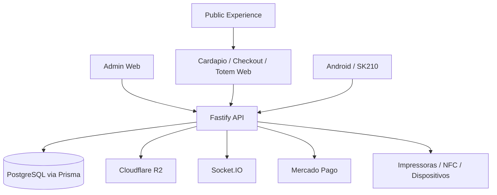
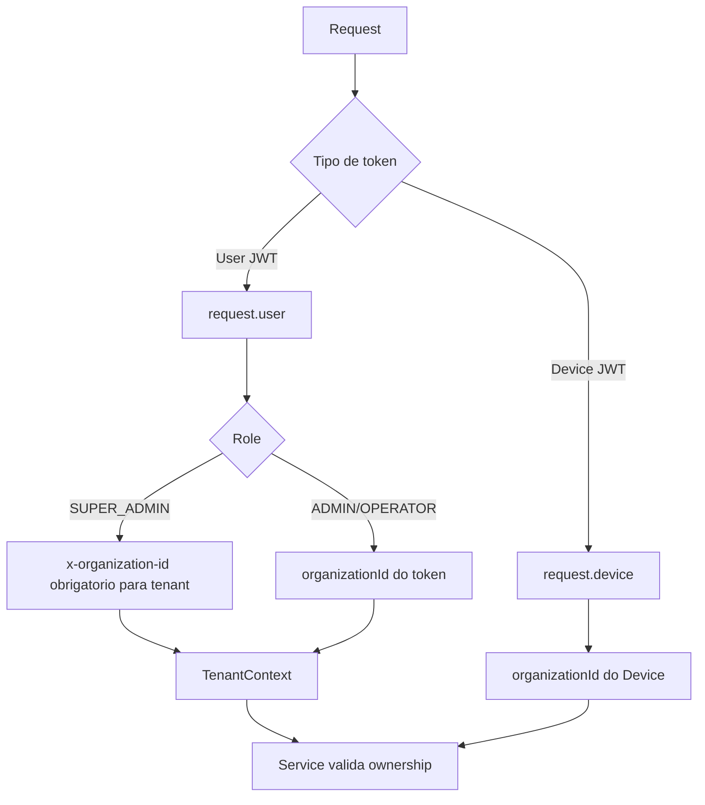
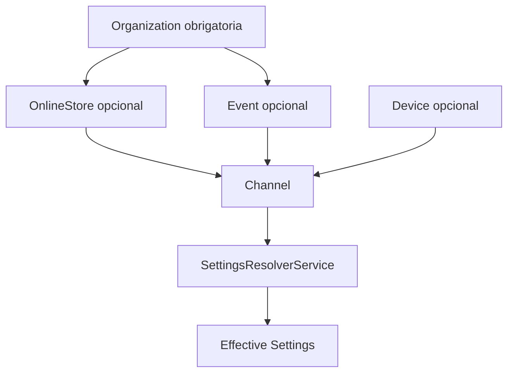
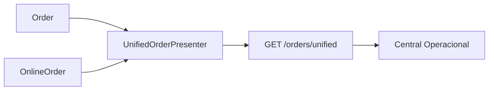
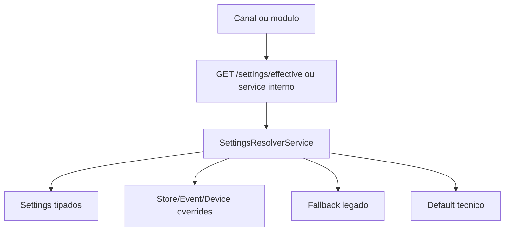
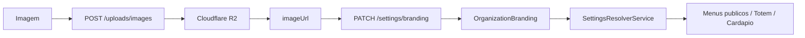
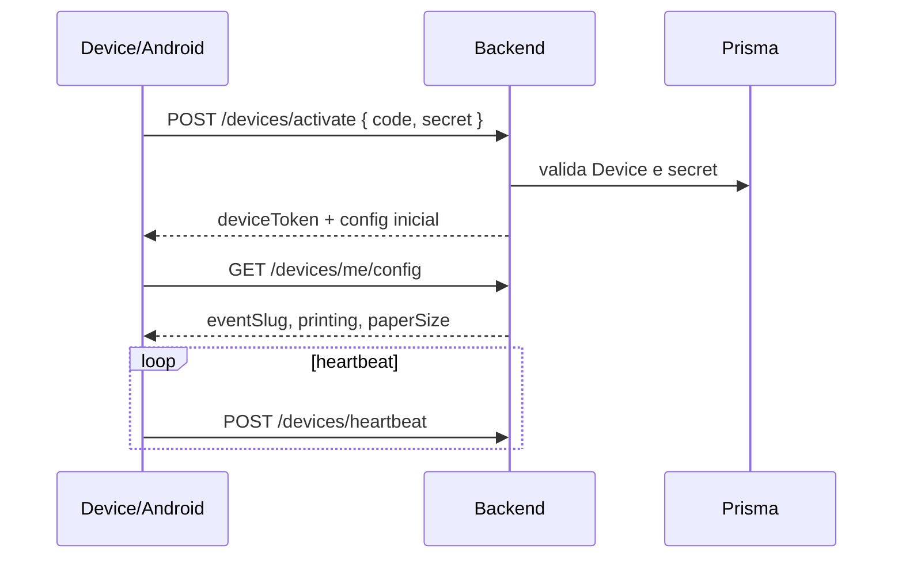
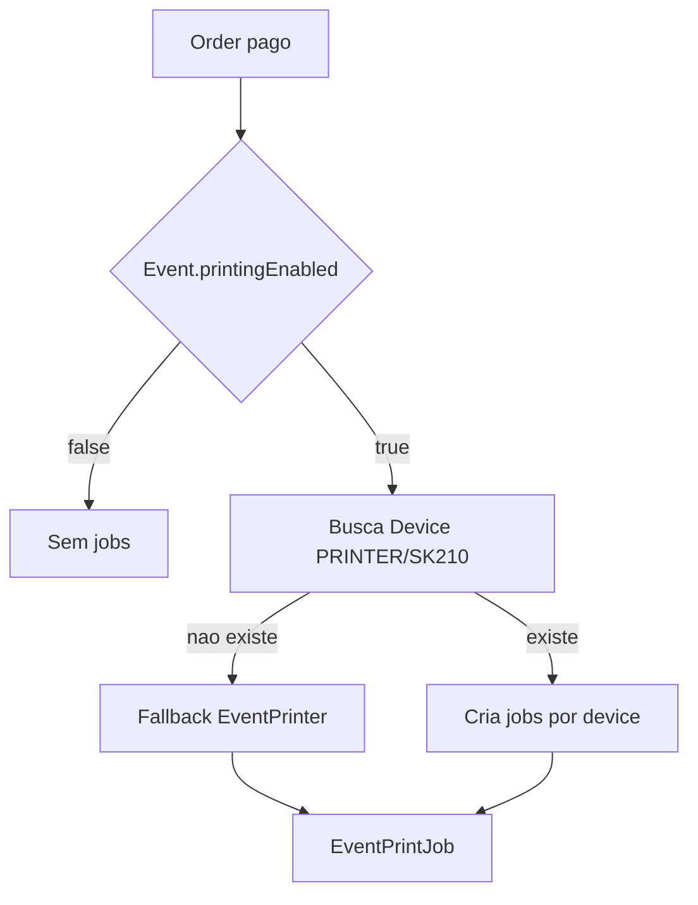

# Arquitetura da Plataforma Defumar

Version: 1.0.0

Status: APPROVED_BASELINE

Owner: Backend

Last Updated: 2026-07-14

Fonte primaria: codigo atual em `prisma/schema.prisma` e `src/modules/**`. Quando README e codigo divergem, o codigo prevalece.

## 1. Visao Geral

A Defumar e uma plataforma SaaS multi-tenant para operacao de eventos e estabelecimentos. O backend atual cobre eventos, lojas online, pedidos, central operacional, catalogo, clientes, pagamentos, impressao, dispositivos, NFC/cashless, uploads e auditoria. A arquitetura-alvo tambem reconhece `Experience` como dominio de produto responsavel por manter a experiencia publica consistente entre Cardapio Digital, Checkout, Totem, Android, Call Screen e canais futuros.

Canais atendidos ou planejados:

- Eventos publicos e Totem de evento.
- Cardapio Digital e Checkout de loja.
- Central Operacional administrativa.
- Android/SK210 e dispositivos autenticados.
- Futuramente PDV, garcom mobile, QR mesa e API publica.

## 2. Stack Tecnica Atual

Confirmado no repositorio:

| Camada | Tecnologia |
| --- | --- |
| Backend | Fastify, TypeScript |
| ORM/Banco | Prisma, PostgreSQL |
| Tempo real | Socket.IO em `src/lib/socket.ts` |
| Frontend admin documentado | React, TanStack Start/Router/Query, Vite, Tailwind, shadcn/ui em `README-FRONT.MD` |
| Android | Mencionado para SK210/WebView/bridge em README e services de device/print; codigo Android nao esta no workspace |
| Uploads | Cloudflare R2, AWS SDK S3, Sharp |
| Pagamentos | Mercado Pago, PIX manual, NFC/cashless |
| Impressao | `EventPrintJob`, `EventPrinter`, `Device` PRINTER/SK210, worker em `src/app.ts` |

## 3. Arquitetura Multi-Tenant

Modelos principais:

- `Organization`: tenant.
- `User`: pertence a `organizationId`; roles em `UserRole`.
- `OrganizationModule`: modulos ativos por tenant.
- `Device`: pertence a `organizationId` e opcionalmente `eventId`.

Contextos:

- `TenantContext`: resolvido por JWT de usuario e `x-organization-id`/impersonacao.
- `PlatformContext`: SUPER_ADMIN pode operar plataforma e impersonar organizacao.
- JWT de usuario: usado por rotas administrativas.
- JWT de dispositivo: usado por `/devices/me/config`, `/devices/heartbeat`, jobs de impressao.

Regras:

- Services devem validar ownership por `organizationId`.
- `organizationId` nunca deve ser usado como `storeId`.
- Rotas publicas precisam resolver tenant por `slug` ou por recurso publico, nunca por header arbitrario.
- SUPER_ADMIN sem impersonacao nao deve executar operacao tenant-specific.

## 4. Hierarquia de Contexto

Arquitetura-alvo:

Papel de cada nivel:

| Nivel | Papel |
| --- | --- |
| Organization | Tenant, defaults globais, modulos, settings globais. |
| Store | Operacao permanente, loja online, delivery, retirada, cardapio digital. |
| Event | Contexto temporario, override de evento, estoque/preco por evento. |
| Device | Hardware especifico: Totem, SK210, PRINTER, CALL_SCREEN. |
| Channel | Consumidor: `DIGITAL_MENU`, `TOTEM`, checkout, Android, API. |
| SettingsResolverService | Aplica fonte nova, override, fallback legado e defaults. |

`eventId` e `storeId` podem coexistir somente quando houver caso real documentado e ADR aprovada. Hoje `Device` nao possui `storeId`.

## 5. Dominios

| Dominio | Responsabilidade | Entidades | Rotas principais | Dependencias | Nao deveria conter |
| --- | --- | --- | --- | --- | --- |
| Auth | Login, JWT, request context | `User` | `POST /sessions`, `GET /users/profile` | Organization, roles | Regras de negocio de pedidos |
| Organizations | Tenants e modulos | `Organization`, `OrganizationModule` | `/super-admin/organizations` | SUPER_ADMIN | Configuracoes por canal em campos soltos |
| Users | Usuarios administrativos | `User` | `/users`, `/users/profile` | Auth, tenant | Dados de cliente final |
| Settings | Configuracao tipada e efetiva | `OrganizationSettings`, `OrganizationBranding`, `BusinessHour`, `BusinessHourException`, `OnlineStoreSettings`, `DeliveryFeeRule` | `/settings`, `/settings/effective`, writes de settings | Tenant, modules | Pedidos, estoque |
| Experience | Experiencia visual publica: branding, home, hero, banners, mensagens, tema, assets, splash, empty states, CTA, layout e componentes publicos | Hoje usa `OrganizationBranding`, campos legados de `Event`/`OnlineStore` e frontend nao disponivel no workspace | Nao possui endpoint proprio; consumido via canais publicos e Settings | Settings, Uploads, Public Experience | Precos, estoque, regras financeiras |
| Catalog | Catalogo global | `CatalogCategory`, `CatalogProduct`, option groups/options | `/catalog-*`, `/product-options` | Organization | Estoque/preco especifico de evento |
| Online Stores | Loja permanente | `OnlineStore`, `OnlineOrder`, `OnlineStoreSettings` | `/online-stores`, `/public/stores/:slug` | Catalog, Settings, Customers | Totem de evento |
| Events | Eventos temporarios | `Event`, `EventProduct`, `Order` | `/events`, `/public/events/:slug/menu` | Catalog, Settings, Devices | Config global permanente |
| Orders | Pedidos nativos e status | `Order`, `OnlineOrder` | `/events/:eventId/orders`, `/online-stores/:storeId/orders`, `/orders/unified` | Catalog, Customers, Print, Payments | Configuracao visual |
| Customers | CRM basico | `Customer`, `CustomerAddress`, `Interest` | `/customers`, `/interests` | Orders | Pagamentos |
| Payments | Transacoes e providers | `PaymentProviderSettings`, `PaymentTransaction` | `/payment-provider-settings`, `/orders/:id/checkout-payment` | Orders, Event legacy PIX | Branding |
| Printing | Filas e roteamento atual | `EventPrintJob`, `EventPrinter`, `Device` | `/print-jobs`, `/devices/print-jobs/pending` | Orders, Devices | Config definitiva futura em `Event` |
| Devices | Ciclo de vida de hardware | `Device` | `/devices`, `/devices/activate`, `/devices/me/config` | Organization, Event | Store context ate ADR |
| NFC | Cashless por evento | `NfcCard`, `NfcCardRead`, `NfcCardTransaction` | `/events/:eventId/nfc-cards`, public NFC routes | Event, Orders | Loja online sem modelagem futura |
| Public Experience | Cardapio, checkout, Totem, Android, Call Screen, QR/Landing/POS futuros | endpoints publicos | `/public/stores/:slug`, `/public/events/:slug/*` | Experience, Settings, Catalog, Orders | Regras duplicadas de precificacao |
| Uploads | Upload e processamento de imagens | R2 keys | `POST /uploads/images` | R2, Sharp, Auth | Persistencia de configuracao |
| Audit | Log operacional | `AuditLog` | `/events/:eventId/audit-logs` | Tenant, users/devices | Segredos em metadata |

## 6. Pedidos

Modelos:

- `Order`: pedido de evento/totem/manual de evento.
- `OnlineOrder`: pedido de loja online/manual de loja.
- `UnifiedOrderDTO`: view em `src/modules/orders/presenters/unified-order-presenter.ts`.

Regras oficiais:

- `Order` e `OnlineOrder` nao devem ser fundidos sem migracao formal.
- Nao criar terceira tabela duplicando pedidos.
- A visao unificada pertence a camada de presenter/service.
- Status nativo e status normalizado devem ser preservados.
- `source`, `channel`, `context`, `fulfillment`, `payment`, `printing`, `items/options` devem vir dos adapters.
- Socket.IO deve emitir eventos nativos e unificados quando pedidos mudarem.

## 7. Catalogo

Catalogo global:

- `CatalogCategory`: categoria global por organizacao.
- `CatalogProduct`: produto global, preco-base, imagem, categoria.
- `CatalogProductOptionGroup` e `CatalogProductOption`: adicionais/opcoes.
- `linkedProduct`: opcao pode referenciar outro produto.

Evento:

- `EventProduct`: vincula produto global ao evento.
- Permite `priceInCents` override, estoque (`trackStock`, `stockQuantity`), `soldOut`, `active`.

Problema atual do Totem:

- Menu publico de evento usa `EventProduct`.
- Catalogo global nao aparece automaticamente no Totem de evento.
- Consulta read-only da Guellos em 2026-07-14 encontrou evento ativo com `0` `EventProduct`.
- Resultado: tela de Totem/evento mostra "Nenhum produto disponivel".

Correcao operacional aplicada em 2026-07-14:

- Totem atual permanece event-based.
- Catalogo do evento deve ser disponibilizado por vinculos reais `EventProduct`.
- `POST /events/:eventId/catalog/sync` cria vinculos idempotentes a partir do catalogo global elegivel.
- O endpoint publico de evento nao faz fallback direto para `CatalogProduct`.
- Novos vinculos herdam preco do catalogo com `EventProduct.priceInCents = null`.
- Produtos ja vinculados nao sao sobrescritos, reativados, removidos ou reestocados automaticamente.
- Produtos/categorias inativos e a categoria tecnica `Itens do Combo` nao sao sincronizados.

Filtros reais em `GetPublicEventMenuService` e `GetPublicEventCatalogMenuService`:

- `Event.active = true`.
- `EventProduct.active = true`.
- `EventProduct.soldOut = false`.
- Se controla estoque: `stockQuantity` precisa ser `null` ou `> 0`.
- `CatalogProduct.active = true`.
- `CatalogCategory.active = true`.

## 8. Settings

Referencia detalhada: [settings-architecture.md](./settings-architecture.md).

Resumo:

- `GET /settings` agrega estado por organizacao.
- `GET /settings/effective` retorna valores resolvidos.
- `SettingsResolverService` aplica nova fonte, overrides, fallback legado e defaults.
- `sources` deve explicar de onde vem cada valor.
- Novas leituras configuraveis devem usar Settings/Resolver.
- Novas escritas devem usar a fonte nova do dominio.

## 9. Branding e Assets

Upload:

- `POST /uploads/images`.
- Sharp processa imagens.
- Cloudflare R2 armazena assets.
- Keys novas usam `organizations/{organizationId}/assets/{assetType}/v1/{hash}-{uuid}.{extension}`.

Persistencia:

- Upload retorna `imageUrl` e `key`, mas nao persiste configuracao.
- `PATCH /settings/branding` persiste URL em `OrganizationBranding`.
- Campos: `logoUrl`, `lightLogoUrl`, `darkLogoUrl`, `faviconUrl`, `bannerDesktopUrl`, `bannerMobileUrl`, `socialImageUrl`, `primaryColor`, `secondaryColor`, `backgroundColor`, `theme`, `defaultProductImageUrl`.

Propagacao:

- `SettingsResolverService` resolve branding efetivo.
- Endpoints publicos devem consumir branding efetivo.
- `Event.logoUrl`, `Event.bannerUrl`, `OnlineStore.logoUrl`, `OnlineStore.bannerUrl` ficam como fallback temporario.
- Branding e assets sao parte do dominio `Experience`, mas a persistencia atual continua em `OrganizationBranding` e campos legados ate migracao formal.

### Experience

`Experience` e o dominio de produto que define como os canais publicos devem parecer, se comportar e comunicar estados ao cliente. Ele nao substitui Settings; ele consome Settings e transforma valores configuraveis em experiencia consistente.

Escopo:

- Branding: logos, cores, tema, favicon e imagens.
- Home/Hero: primeira tela, banners, splash e mensagens.
- Mensagens: textos de boas-vindas, indisponibilidade, confirmacao, empty states e CTAs.
- Layout: regras de densidade, cards, grids, listas, checkout e Totem.
- Componentes publicos: botoes, badges, estados, loading, skeleton, errors e iconografia.
- Motion: animacoes permitidas, transicoes, feedback de toque e regras para kiosk.

Fora do escopo:

- Calculo de preco, taxa, total, estoque e pagamento.
- Modelos de pedidos.
- Regras tenant-safe.

Referencia detalhada: [experience-design.md](./experience-design.md).

## 10. Dispositivos

Modelo `Device`:

- `organizationId`
- `eventId?`
- `type`: `TOTEM`, `PRINTER`, `CALL_SCREEN`, `SK210`
- `status`: `ACTIVE`, `PAUSED`, `OFFLINE`, `MAINTENANCE`
- `authStatus`: `PENDING`, `ACTIVE`, `REVOKED`
- `tokenHash`, `deviceSecretHash`
- `metadata`
- heartbeat e auditoria

Fluxo:

Limitacao atual: `Device` nao possui `storeId`. Totem de operacao diaria sem evento exige decisao arquitetural antes de migration.

## 11. Pagamentos

Estado atual:

- PIX manual de evento em `Event.pixEnabled`, `pixKey`, `pixReceiverName`, `pixCity`, `pixInstructions`, `pixPaymentExpirationMinutes`.
- Mercado Pago em `PaymentProviderSettings`.
- Transacoes em `PaymentTransaction`.
- NFC/cashless usa `NfcCard`, `NfcCardTransaction` e `PaymentTransaction` manual.

Rotas publicas:

- `GET /events/:eventId/checkout-payment-settings`.
- `POST /public/orders/:orderId/checkout-payment`.
- `POST /orders/:orderId/pix-automatic-payment`.
- `POST /public/events/:eventSlug/orders/:orderId/pay-with-nfc-balance`.

Risco: pagamentos ainda resolvem configuracoes fora de Settings e dependem de campos legados em `Event`.

## 12. Impressao

Estado atual:

- `Event.printingEnabled` habilita impressao.
- `Event.autoPrintEnabled`, `printMode`, `printerPaperSize` sao configuracoes legadas.
- `CreatePrintJobsForOrderService` cria `EventPrintJob` apenas se `paymentStatus` for `PAID` ou `NOT_REQUIRED`.
- Prioridade de destino: `Device` PRINTER/SK210 ativo do evento; fallback `EventPrinter`.
- `Device.metadata` pode carregar `printerSector`, `connectionType`, `paperSize`.

## 13. Socket.IO

O backend emite eventos de pedidos nativos e unificados:

- `order-created`
- `order-updated`
- `payment-transaction-updated`
- `nfc-card-updated`
- `unified-order-created`
- `unified-order-updated`

Rooms observadas:

- `event:{eventId}`
- `organization:{organizationId}`

Requisito alvo:

- Canais publicos nao devem depender de broadcast global.
- Central Operacional deve usar eventos unificados.
- Android/dispositivos precisam reconectar e buscar estado por endpoints idempotentes.

## 14. Seguranca

Regras obrigatorias:

- Preco, taxa, total, deliveryFee e troco oficial sao calculados no backend.
- Frontend nunca e fonte oficial de valor financeiro.
- Secrets R2, Mercado Pago, webhookSecret, accessToken e deviceSecret nunca retornam sem mascaramento.
- Upload deve validar tipo, tamanho e origem de URL R2.
- Rotas tenant-safe validam ownership no service.
- Rotas publicas resolvem tenant por recurso (`slug`, `orderId`, device token).
- Audit logs nao devem gravar buffers, credenciais ou dados pessoais completos.

## 15. Principios Arquiteturais Obrigatorios

1. Backend e fonte da verdade para valores financeiros.
2. Toda leitura configuravel usa Settings ou `SettingsResolverService`.
3. Toda escrita nova usa a fonte nova de verdade.
4. Legado e fallback temporario, nao destino de nova arquitetura.
5. Endpoints publicos nao resolvem configuracao manualmente.
6. Frontend nao calcula preco, taxa ou total oficial.
7. DTOs publicos devem ser estaveis e versionaveis.
8. Migrations devem ser aditivas ate plano formal de remocao.
9. Contratos nao devem ser inventados como existentes.
10. Multi-tenant deve ser validado nos services.
11. Fallback deve existir em um unico ponto.
12. `OrderCard`/drawer nao duplicam normalizacao de pedido.
13. Canais publicos nao criam arquiteturas paralelas.
14. Nenhum dominio novo nasce sem atualizar a documentacao.

## 16. Dependency Map

| Dominio | Depende de | Consumido por | Fonte atual | Fonte-alvo | Legado |
| --- | --- | --- | --- | --- | --- |
| Experience | Settings, Uploads, Branding | Cardapio, Totem, Checkout, Android, Call Screen | `OrganizationBranding` + frontend/campos legados | Experience + Visual Bootstrap | estilos e textos espalhados |
| Branding | Uploads, Settings | Cardapio, Totem, Evento publico | `OrganizationBranding` + `Event`/`OnlineStore` | Resolver efetivo | campos logo/banner em Event/OnlineStore |
| Catalogo evento | Catalogo global, EventProduct | Totem/event menu | `EventProduct` | EventProduct ou bootstrap com regras claras | nenhum fallback global automatico |
| Loja online | Catalogo, Settings, Delivery | Cardapio Digital, Checkout | `OnlineStore`, `OnlineStoreSettings` | Settings + OnlineStore operacional | `OnlineStore.isOpen/logo/banner` |
| Pagamentos | Orders, Providers | Checkout, Totem, Admin | `Event.pix*`, `PaymentProviderSettings` | Payment settings por contexto | PIX em Event |
| Impressao | Orders, Devices | Android, SK210, Admin | `Event.printing*`, `EventPrinter`, `Device.metadata` | Print settings + routing | EventPrinter/Event fields |
| Totem | Event, Device, Catalog, Payments | Android/Totem Web | endpoints publicos de evento | Bootstrap + SettingsResolver | `Event.totem*` |
| Central Operacional | Orders, OnlineOrders | Admin | `UnifiedOrderDTO` | Presenter/adapters | N/A |

## 17. Riscos Atuais

| Risco | Severidade | Evidencia | Mitigacao |
| --- | --- | --- | --- |
| Totem dependente de `EventProduct` | Alta | Operacao atual exige vinculos `EventProduct`; Guellos foi sincronizada em 2026-07-14 | Manter sync administrativo enquanto Totem loja/bootstrap nao existem |
| `Device` sem `storeId` | Alta | Modelo Prisma possui apenas `eventId` | ADR-003 antes de migration |
| `Event.totem*` legado | Media | Campos no modelo `Event` | Migrar para Totem settings |
| `selectedOptions` no schema publico de evento | Corrigido | Service aceita e schema publico agora preserva o campo | Manter testes de contrato |
| Pagamentos fora de Settings | Alta | Checkout le `Event.pix*` | Fase pagamentos |
| Impressao fora de Settings | Alta | CreatePrintJobs le `Event.printing*` | Fase impressao/producao |
| README divergente das rotas reais | Media | Ver secao abaixo | Atualizar docs |
| Configuracao distribuida | Alta | Event/OnlineStore/Device/Payment | Resolver central |
| Contratos publicos diferentes por canal | Alta | store/event/device endpoints separados | BootstrapService interno |
| Experiencia publica inconsistente | Media | Cardapio, Totem, Checkout e Android nao possuem guia unico no codigo atual | Criar e seguir `experience-design.md` |

## 18. Roadmap

### Fase A: Correcoes obrigatorias para Guellos

Objetivo: fazer operacao real funcionar sem refatoracao ampla.

Entregaveis:

- Corrigir `selectedOptions` em `POST /public/events/:slug/orders`. Concluido em 2026-07-14.
- Resolver catalogo vazio por evento: sincronizacao explicita de `EventProduct` concluida para Guellos em 2026-07-14.
- Confirmar contexto do Totem da Guellos: evento ou loja.
- Garantir branding publico via SettingsResolver em todos os canais usados.

Criterios:

- Totem mostra produtos.
- Pedido com adicionais persiste snapshots.
- Total calculado pelo backend.
- Nenhum contrato publico quebrado.

### Fase B: Centralizacao dos Settings

- Pagamentos por contexto.
- Impressao/producao por contexto.
- Totem settings e Device settings.
- Fallback documentado para `Event`/`Device.metadata`.

### Fase C: Bootstrap de canais

- Criar `BootstrapService` interno.
- Definir Visual Bootstrap para Experience.
- Adaptar endpoints atuais sem nova rota publica inicialmente.
- Definir DTO versionado.

### Fase D: Totem

- Consumir bootstrap.
- Separar Totem de evento e Totem de loja.
- Migrar `Event.totem*`.

### Fase E: Android

- Ajustar config de dispositivo.
- Validar NFC, impressao, pagamentos e offline/cache.

### Fase F: Remocao de legado

- Backfill.
- Bloqueio de escrita legada.
- Metricas de uso.
- Remocao aditiva/controlada.

## Rotas Documentadas Divergentes

O `README.md` contem exemplos antigos que nao batem com o codigo atual:

| Documentado | Rota real no codigo |
| --- | --- |
| `GET /events/public/:slug` | `GET /public/events/:slug/menu` ou `GET /public/events/:slug/catalog-menu` |
| `POST /orders/events/:eventId` | `POST /public/events/:slug/orders` |
| `GET /orders/public/events/:eventId/call-screen` | `GET /public/events/:slug/call-screen-orders` ou `GET /public/events/:slug/orders` |
| `POST /nfc-cards/identify` | `POST /public/events/:eventSlug/nfc/identify` |
| `POST /nfc-cards/pay-order` | `POST /public/events/:eventSlug/orders/:orderId/pay-with-nfc-balance` |

Essas divergencias sao documentais; nenhum comportamento foi alterado nesta revisao.

## Arquivos Reais Referenciados

- `prisma/schema.prisma`
- `src/app.ts`
- `src/modules/settings/**`
- `src/modules/online-stores/**`
- `src/modules/events/**`
- `src/modules/orders/**`
- `src/modules/devices/**`
- `src/modules/payments/**`
- `src/modules/print-jobs/**`
- `src/modules/device-print-jobs/**`
- `src/modules/printers/**`
- `src/modules/nfc-cards/**`
- `src/modules/uploads/**`
- `src/lib/socket.ts`
- `README.md`
- `README-FRONT.MD`
