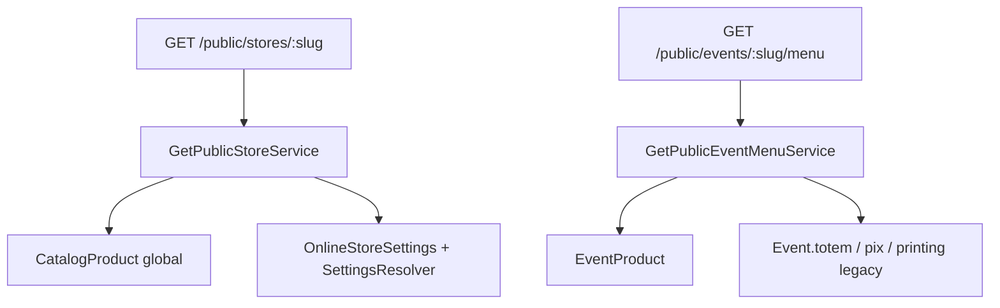
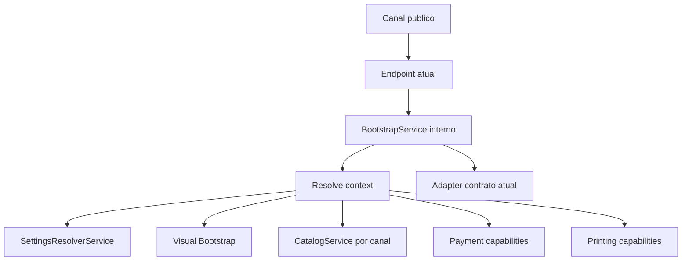
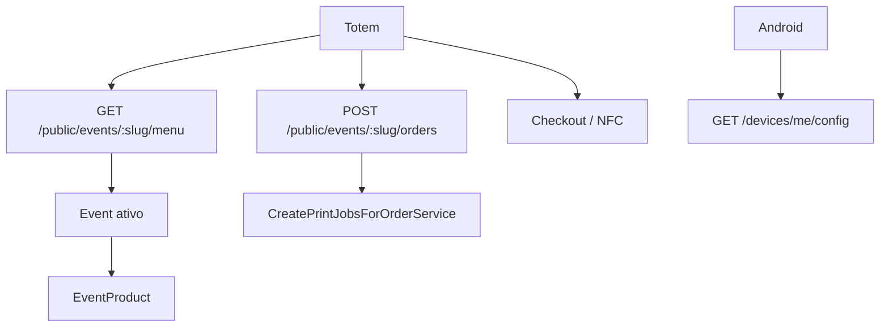
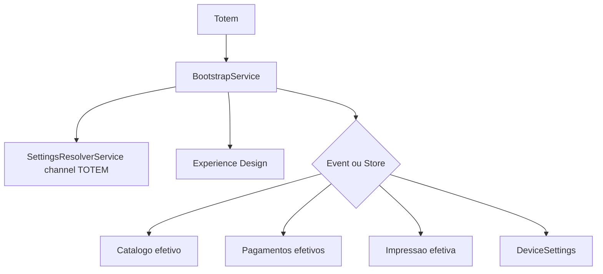

# Arquitetura de Public Experience

Version: 1.0.0

Status: PROPOSED_BASELINE

Last Updated: 2026-07-14

Este documento trata da Public Experience da Defumar: Cardapio Digital, Checkout, Totem, PDV, Android, Evento Publico, Call Screen, QR/Landing futuros e API publica. Ele nao cria contratos novos; separa estado atual, arquitetura-alvo e plano incremental.

## 1. Estado Atual

| Canal | Branding | Catalogo/produtos | Opcoes/precos | Horarios/operacao | Pagamentos | Impressao | Dispositivo |
| --- | --- | --- | --- | --- | --- | --- | --- |
| Cardapio Digital loja | `GET /public/stores/:slug`, agora com branding efetivo | `CatalogCategory`/`CatalogProduct` por `organizationId` | optionGroups do catalogo global | `OnlineStoreSettingsService.resolveOperation` | pedido online usa metodo informado, pagamento online ainda parcial | nao completo para loja | nao usa Device |
| Checkout loja | `GET /public/stores/:slug` | itens do pedido online | backend recalcula total/taxa delivery | Settings delivery/online orders | `OnlineOrderPaymentMethod` e fluxo online | `printing.enabled=false` no DTO unificado nesta fase | nao usa Device |
| Evento publico | `GET /public/events/:slug/menu` | `EventProduct` | preco override em `EventProduct`, options de catalogo | nao bloqueia por BusinessHour hoje | PIX manual em `Event.pix*`, Mercado Pago provider | via EventPrintJob se pago | opcional device JWT na criacao |
| Totem | Provavelmente consome menu publico de evento; frontend nao esta no workspace | `EventProduct` | service calcula e schema publico preserva `selectedOptions` | `Event.totem*`, sem Settings tipado | PIX/NFC/checkout evento | Event/Device/EventPrinter | `Device` com `eventId` |
| Android/SK210 | `GET /devices/me/config` nao retorna branding | Nao confirmado no app; README indica uso do menu publico | Nao confirmado | Device config por evento | NFC/checkout via endpoints publicos | `/devices/print-jobs/pending` | Device JWT |
| PDV | Nao confirmado | Nao iniciado como canal proprio | Nao confirmado | Nao confirmado | Nao confirmado | Nao confirmado | Nao confirmado |
| Call Screen | Sem branding especifico | `GET /public/events/:slug/call-screen-orders` | N/A | Event ativo | so pedidos pagos/not_required | N/A | Nao usa Device |
| API publica futura | Nao existe | Nao existe | Nao existe | Nao existe | Nao existe | Nao existe | Nao existe |

## 2. Problemas

- Fluxos paralelos entre loja e evento.
- Totem de evento depende de `EventProduct`; catalogo global nao aparece automaticamente.
- Guellos tinha evento ativo com zero `EventProduct`, causando catalogo vazio.
- Correcao operacional de 2026-07-14: `POST /events/:eventId/catalog/sync` sincroniza produtos elegiveis do catalogo global para vinculos reais `EventProduct`.
- Nao existe fallback direto para `CatalogProduct` nos endpoints publicos de evento; a sincronizacao e explicita, administrativa e idempotente.
- `selectedOptions` era ausente em `createOrderSchema`; corrigido em 2026-07-14 para preservar adicionais no pedido publico de evento.
- Pagamentos de evento usam `Event.pix*`, fora de Settings.
- Impressao usa `Event.printing*`, `EventPrinter` e `Device.metadata`, fora de Settings.
- `Device` nao possui `storeId`, dificultando Totem de operacao diaria.
- README documenta endpoints antigos.
- Cada canal monta seu proprio DTO publico.
- Nao existe ainda um Visual Bootstrap comum para home, hero, mensagens, assets, empty states e layout.

## 3. Arquitetura-Alvo

Objetivo: canais publicos devem compartilhar resolucao de contexto, settings, experience, branding, catalogo, checkout, pagamentos, impressao e capacidades.

Alternativas para bootstrap:

| Alternativa | Pros | Contras | Seguranca | Cache | Compatibilidade |
| --- | --- | --- | --- | --- | --- |
| A. `GET /public/bootstrap` | Endpoint unico | Contexto via query pode ficar ambiguo | Exige validacao forte | Bom com query hash | Quebra consumidores se substituir cedo |
| B. `GET /public/bootstrap/:slug` | Simples para frontend | Slug ambiguo entre store/event | Precisa tipo/canal adicional | Bom | Medio |
| C. `GET /public/channels/:channel/bootstrap` | Canal explicito | Mais verboso | Melhor validacao por canal | Bom por canal | Bom para novos canais |
| D. Endpoints atuais usando `BootstrapService` interno | Preserva contratos | Mantem varias rotas externas | Seguranca incremental | Cache por endpoint atual | Melhor para migracao |

Recomendacao: **D primeiro**. Criar `BootstrapService` interno e adaptar endpoints atuais. Rota publica unica fica como ADR-002 Proposed ate aprovacao.

### Bootstrap Visual

O bootstrap tecnico resolve contexto e dados. O Bootstrap Visual resolve a experiencia publica consumida por Cardapio, Totem, Android e Checkout.

Estrutura conceitual:

```json
{
  "branding": {},
  "experience": {
    "home": {},
    "hero": {},
    "messages": {},
    "layout": {},
    "components": {}
  },
  "operation": {},
  "capabilities": {},
  "categories": [],
  "products": [],
  "checkout": {}
}
```

Esse bloco ainda nao existe como contrato real. Ele deve nascer primeiro como DTO interno do futuro `BootstrapService`, com adapter para os contratos publicos atuais.

## 4. Contexto de Resolucao

DTO interno proposto:

```json
{
  "organizationId": "string",
  "storeId": "string opcional",
  "eventId": "string opcional",
  "deviceId": "string opcional",
  "channel": "DIGITAL_MENU | CHECKOUT | TOTEM | POS | ANDROID | EVENT_MENU | CALL_SCREEN | API",
  "date": "ISO opcional",
  "locale": "pt-BR opcional"
}
```

Validacoes:

- `organizationId` e obrigatorio depois da resolucao inicial.
- `storeId`, se existir, deve pertencer a `organizationId`.
- `eventId`, se existir, deve pertencer a `organizationId`.
- `deviceId`, se existir, deve pertencer a `organizationId`.
- `deviceId` nao deve implicar `storeId` enquanto ADR-003 estiver pendente.
- `channel` nao e `source` nem `fulfillment`.

## 5. Channel Enum

Canais propostos, sem alterar codigo nesta fase:

| Channel | Uso |
| --- | --- |
| `DIGITAL_MENU` | Cardapio digital de loja. |
| `CHECKOUT` | Checkout publico de pedido. |
| `TOTEM` | Totem web/kiosk. |
| `POS` | PDV futuro. |
| `ANDROID` | App Android/SK210. |
| `EVENT_MENU` | Menu publico de evento. |
| `CALL_SCREEN` | Painel de chamada. |
| `API` | API publica futura. |

Diferencas:

- `channel`: consumidor/interface.
- `source`: origem do pedido (`DIGITAL_MENU`, `ADMIN`, `POS`, etc.).
- `fulfillment`: forma de atendimento (`DELIVERY`, `PICKUP`, `COUNTER`, `DINE_IN`).

## 6. Bootstrap DTO Proposto

Contrato proposto, nao implementado:

```json
{
  "version": 1,
  "context": {},
  "branding": {},
  "experience": {},
  "operation": {},
  "schedule": {},
  "capabilities": {},
  "catalog": {},
  "checkout": {},
  "payments": {},
  "printing": {},
  "device": {},
  "nfc": {},
  "messages": {},
  "sources": {}
}
```

Blocos:

- `context`: organization/store/event/device/channel resolvidos.
- `branding`: logo, banner, cores, tema, assets.
- `experience`: home, hero, mensagens, layout, componentes, splash, CTA, empty states e regras visuais por canal.
- `operation`: aberto, aceitando pedidos, motivo de indisponibilidade.
- `schedule`: horarios, excecoes, timezone.
- `capabilities`: pagamentos, NFC, impressao, delivery, retirada.
- `catalog`: categorias, produtos, opcoes, precos oficiais.
- `checkout`: regras de cliente, notas, pedido minimo, fulfillment.
- `payments`: metodos habilitados, chaves publicas ou flags mascaradas.
- `printing`: se o canal deve criar/consumir jobs.
- `device`: configuracao efetiva de hardware.
- `nfc`: cashless e leitura de cartao.
- `messages`: textos de home, botoes e mensagens operacionais.
- `sources`: origem de cada bloco para auditoria.

## 7. Cache e Versionamento

Regras alvo:

- Todo bootstrap deve ter `version` e `updatedAt`.
- `ETag` futuro pode derivar de settings/catalog/operation updatedAt.
- Assets R2 ja sao versionados por key `v1/hash-uuid`.
- React Query deve invalidar por `updatedAt`/eventos Socket.IO.
- Totem/Android podem fazer cache local, mas precisam endpoint de refresh.
- Breaking changes exigem nova versao do DTO.

## 8. Compatibilidade

Endpoints atuais devem continuar:

- `GET /public/stores/:slug`
- `GET /public/events/:slug/menu`
- `GET /public/events/:slug/catalog-menu`
- `GET /devices/me/config`

Internamente, cada um pode chamar `BootstrapService` e adaptar a resposta ao contrato antigo. Isso evita quebrar frontend existente e app Android.

## 9. Plano Incremental

1. Corrigir `selectedOptions` no pedido publico de evento. Concluido em 2026-07-14.
2. Corrigir catalogo vazio da Guellos: concluido em 2026-07-14 por sync explicito de `EventProduct`.
3. Documentar contexto real do Totem.
4. Formalizar Experience Design e Visual Bootstrap.
5. Criar `BootstrapService` interno.
6. Adaptar menu publico de loja.
7. Adaptar menu publico de evento.
8. Adaptar Totem.
9. Adaptar Android.
10. Avaliar endpoint publico unico.
11. Depreciar contratos antigos apenas com metricas e fallback.

## 10. Criterios de Aceite

- Testes de contrato para cada endpoint atual.
- Testes tenant-safe para store/event/device.
- Testes de catalogo: sem produtos, com produtos, estoque, soldOut, categoria inativa.
- Testes de preco: base, override, opcoes, linkedProduct.
- Testes de settings: branding, horario, indisponivel, fallback legado.
- Testes de pagamento: PIX manual, Mercado Pago indisponivel, NFC saldo insuficiente.
- Testes de impressao: paid/not_required, pending nao imprime, Device vs EventPrinter.
- Sem exposicao de secrets.

## Fluxo Publico Atual



## Fluxo Publico Futuro



## Totem Atual



## Totem Futuro



## Rotas Reais Referenciadas

- `src/modules/online-stores/routes/online-stores-routes.ts`
- `src/modules/events/routes/events-routes.ts`
- `src/modules/orders/routes/orders-routes.ts`
- `src/modules/devices/routes/devices-routes.ts`
- `src/modules/payments/routes/payments-routes.ts`
- `src/modules/nfc-cards/routes/nfc-cards-routes.ts`
