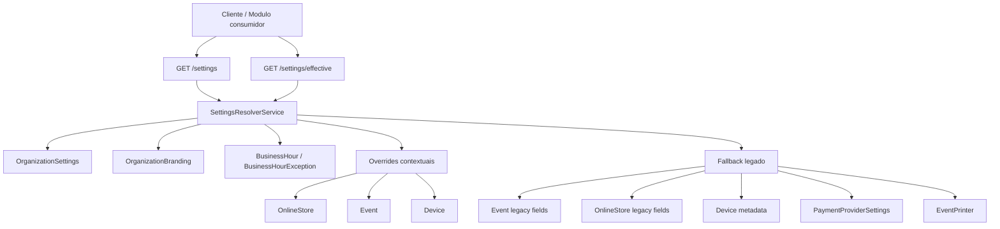
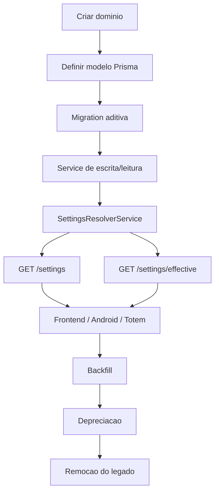
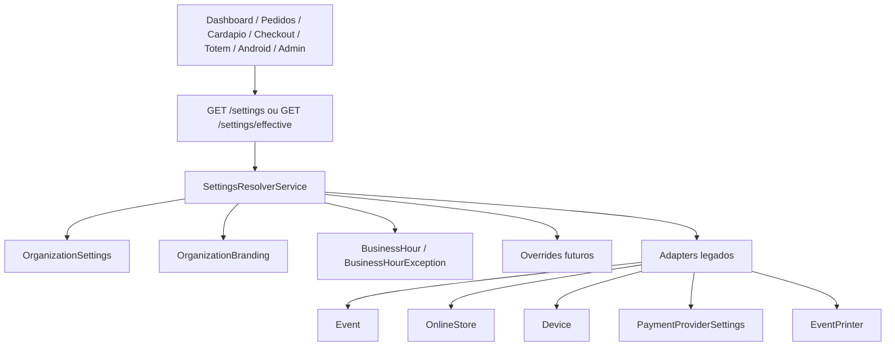
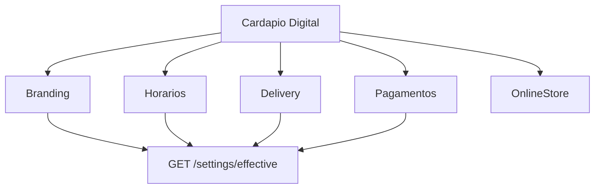
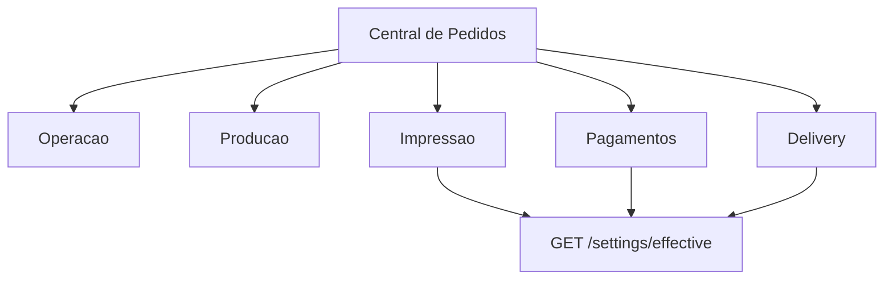
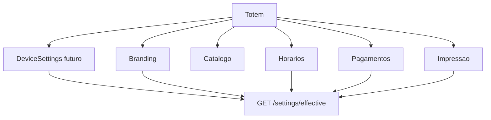

# Centro de Configuracoes - Arquitetura Oficial

Documento versionado da arquitetura do Centro de Configuracoes da Defumar Events Platform.

Version: `1.1.0`  
Status: `APPROVED`  
Owner: `Backend`  
Reviewed by: `Frontend`  
Last Updated: `2026-07-13`  
Escopo desta revisao: backend atual do repositorio, sem execucao de migrations, sem backfill e sem alteracao de codigo de producao.

## Visao Geral



## Glossary

| Termo | Significado |
|---|---|
| Settings | Configuracao persistida em fonte oficial do Centro de Configuracoes. |
| Effective | Configuracao ja resolvida apos aplicar contexto, overrides, fallback legado e defaults. |
| Override | Configuracao contextual que substitui uma configuracao mais global. |
| Adapter | Camada de compatibilidade que le fonte legada e apresenta no contrato novo. |
| Legacy | Fonte temporaria durante migracao, como campos em `Event`, `OnlineStore`, `Device.metadata` ou `EventPrinter`. |
| Context | Escopo usado para resolver configuracao: Organizacao, Loja, Evento, Dispositivo e futuramente PDV. |
| Domain | Area funcional de configuracao, como Branding, Horarios, Delivery, Pagamentos ou Impressao. |
| Source | Origem do valor retornado, por exemplo `ORGANIZATION`, `STORE`, `EVENT_LEGACY`, `DEVICE_LEGACY` ou `DEFAULT`. |
| Backfill | Processo controlado de copiar dados legados para a nova fonte de verdade. |
| Depreciation | Periodo em que a fonte legada ainda existe, mas deixa de ser a forma preferencial de leitura/escrita. |

## Architecture Tree

```text
Settings
  General
  Branding
  Business Hours
  Online Orders
  Delivery
  Payments
  Printing
  Production
  Operation
  Totem
  Devices
  Digital Menu
  Notifications
  Integrations
  Security
  Audit
```

## Domain Lifecycle



## Maturity Model

| Maturity | Significado |
|---|---|
| `Planned` | Dominio definido arquiteturalmente, sem implementacao dedicada. |
| `Foundation` | Modelo/endpoint base existe, mas consumidores e writes ainda nao migraram completamente. |
| `Beta` | Leitura pelo Centro de Configuracoes existe, mas fallback legado ainda e relevante. |
| `Stable` | Leitura e escrita principais usam Settings; legado permanece apenas para compatibilidade controlada. |
| `Mature` | Dominio esta migrado, testado, versionado e sem dependencia operacional do legado. |
| `Legacy` | Fonte antiga mantida apenas por compatibilidade ate remocao. |

| Dominio | Maturity atual | Observacao |
|---|---|---|
| Geral | `Foundation` | `OrganizationSettings` existe e tem endpoint de escrita. |
| Branding | `Foundation` | `OrganizationBranding` existe; overrides de `Event` e `OnlineStore` ainda sao legados. |
| Horarios | `Foundation` | `BusinessHour` e `BusinessHourException` existem; consumidores ainda nao confirmados. |
| Loja Online | `Beta` | `OnlineStoreSettings` existe; `OnlineStore` permanece como entidade operacional e fallback legado. |
| Delivery | `Beta` | `OnlineStoreSettings` e `DeliveryFeeRule` existem com regra `FLAT` e `NEIGHBORHOOD`. |
| Pagamentos | `Planned` | `PaymentProviderSettings` existe, mas ainda nao esta migrado para dominio Settings. |
| Impressao | `Planned` | `Event`, `EventPrinter` e `Device.metadata` ainda sustentam o fluxo. |
| Producao | `Planned` | Sem modelo dedicado confirmado. |
| Totem | `Planned` | Campos `Event.totem*` e `Device.metadata` ainda sao fontes legadas. |
| Dispositivos | `Planned` | `Device` existe; `DeviceSettings` ainda nao. |
| Digital Menu | `Planned` | Depende de branding, horarios, loja e delivery. |
| Notifications | `Planned` | Sem modelo dedicado confirmado. |
| Integrations | `Planned` | Sem modelo generico; pagamentos sao caso especifico atual. |
| Security | `Planned` | Ainda distribuido entre auth, request context e guards. |

## 1. Objetivo do Centro de Configuracoes

O Centro de Configuracoes centraliza a leitura, a escrita futura e a resolucao efetiva das configuracoes da plataforma. O problema atual e que entidades de operacao, como `Event`, `OnlineStore` e `Device`, acumulam configuracoes de dominios diferentes:

- `Event` hoje concentra branding, PIX manual, impressao, totem, status operacional e periodo do evento.
- `OnlineStore` hoje concentra dados operacionais basicos, branding simples e override manual de abertura.
- `Device` hoje concentra identificacao, vinculo com evento, estado de autenticacao e `metadata` livre.
- `PaymentProviderSettings` ja e um modelo dedicado para provedores de pagamento, mas ainda fica fora de um contrato agregado de configuracoes.
- `EventPrinter` modela impressoras por evento e funciona como fonte ativa/legada de impressao.

Essa distribuicao torna a plataforma dificil de evoluir porque cada tela ou servico pode ler um campo diferente, implementar fallback proprio ou escrever em lugares distintos. O Centro de Configuracoes passa a ser a camada estavel: consumidores devem ler `GET /settings` ou `GET /settings/effective`, e a resolucao de precedencia deve passar por `SettingsResolverService`.

O objetivo nao e apagar o legado de uma vez. O objetivo e criar um contrato estavel, multi-tenant, auditavel e preparado para migracao incremental, usando campos legados como adapters/fallbacks ate que cada dominio tenha fonte definitiva.

## 2. Estado Atual

### Implementado

Modelos Prisma implementados:

- `OrganizationSettings`
- `OrganizationBranding`
- `BusinessHour`
- `BusinessHourException`
- `OnlineStoreSettings`
- `DeliveryFeeRule`

Enums Prisma implementados:

- `SettingsContextType`: `ORGANIZATION`, `ONLINE_STORE`
- `SettingsChannel`: `ALL`, `DELIVERY`, `PICKUP`, `DIGITAL_MENU`, `TOTEM`, `COUNTER`
- `BrandingTheme`: `LIGHT`, `DARK`, `SYSTEM`
- `OnlineOrderFulfillmentType`: `DELIVERY`, `PICKUP`, `COUNTER`, `DINE_IN`
- `DeliveryFeeRuleType`: `FLAT`, `NEIGHBORHOOD`

Modulo backend implementado:

- `src/modules/settings/routes/settings-routes.ts`
- `src/modules/settings/controllers/settings-controllers.ts`
- `src/modules/settings/schemas/settings-schemas.ts`
- `src/modules/settings/services/get-settings-service.ts`
- `src/modules/settings/services/settings-resolver-service.ts`
- `src/modules/settings/services/business-hours-service.ts`
- `src/modules/settings/services/update-general-settings-service.ts`
- `src/modules/settings/services/update-branding-settings-service.ts`
- `src/modules/settings/services/settings-shared.ts`

Rotas registradas em `src/app.ts`:

- `GET /settings`
- `GET /settings/effective`
- `PATCH /settings/general`
- `GET /settings/branding`
- `PATCH /settings/branding`
- `GET /settings/business-hours`
- `PUT /settings/business-hours`
- `POST /settings/business-hours/exceptions`
- `PATCH /settings/business-hours/exceptions/:exceptionId`
- `DELETE /settings/business-hours/exceptions/:exceptionId`
- `GET /settings/online-orders?storeId=:storeId`
- `PATCH /settings/online-orders?storeId=:storeId`
- `GET /settings/delivery?storeId=:storeId`
- `PATCH /settings/delivery?storeId=:storeId`
- `GET /settings/delivery/rules?storeId=:storeId`
- `POST /settings/delivery/rules`
- `PATCH /settings/delivery/rules/:ruleId`
- `DELETE /settings/delivery/rules/:ruleId`

Todas usam `verifyJWT` e `requireTenantContext` via `settingsRoutes`.

### Parcial

- `SettingsResolverService` resolve `general`, `branding`, `businessHours` e expõe adapters legados basicos para `event`, `store` e `device`.
- `GET /settings` agrega dados existentes de `OnlineStore`, `Event`, `Device`, `EventPrinter`, `OrganizationModule` e `PaymentProviderSettings`.
- `GET /settings` ja expõe slots futuros como `onlineOrders`, `delivery`, `payments`, `printing`, `production`, `operation`, `totem`, `digitalMenu`, `notifications`, `integrations` e `security`, mas estes blocos ainda retornam `null`.
- `PaymentProviderSettings` e listado de forma mascarada por `ListPaymentProviderSettingsService`.
- `BusinessHour` permite contexto `ORGANIZATION` e `ONLINE_STORE`, mas ainda nao possui contexto proprio para `EVENT`, `DEVICE` ou `PDV`.

### Legado ativo

- `PATCH /events/:id` ainda escreve branding, PIX, totem e impressao em `Event`.
- `PATCH /online-stores/:id` ainda escreve branding simples e dados operacionais em `OnlineStore`.
- `PUT /payment-provider-settings/:provider` ainda escreve configuracoes de pagamento no modelo dedicado atual.
- Rotas de impressoras por evento ainda escrevem em `EventPrinter`.
- Rotas de dispositivos ainda escrevem estado/configuracoes em `Device`, incluindo `metadata`.

### Planejado

- `OnlineStoreSettings`
- dominio de `Delivery`
- settings de pagamentos por contexto
- `PrintRoutingRule`
- `ProductionSector` / settings de producao
- `EventTotemSettings` / `DeviceSettings`
- settings de integracoes, notificacoes e seguranca
- adapters de leitura em rotas publicas
- backfill e depreciacao controlada

### Nao existente confirmado

Nao ha, no estado atual auditado, modelos dedicados para:

- `OnlineStoreSettings`
- `DeliveryZone`
- `DeliveryFeeRule`
- `PrintRoutingRule`
- `ProductionSector`
- `DeviceSettings`
- `EventTotemSettings`
- `NotificationSettings`
- `SecuritySettings`
- `IntegrationSettings`

### Frontend

Frontend administrativo novo para Organizacao, Branding e Horarios nao foi confirmado neste workspace. A pasta auditada e o backend. Qualquer afirmacao sobre tela frontend deve ser validada no repositorio do frontend antes de migrar consumidores.

## 3. Inventario de Campos Legados

| Dominio | Campo | Modelo atual | Tipo | Uso atual confirmado | Leitura atual | Escrita atual | Consumidores conhecidos | Nova fonte futura | Risco | Status |
|---|---|---|---|---|---|---|---|---|---|---|
| Branding | `logoUrl` | `Event` | `String?` | Branding de evento/cardapio publico | `GET /events/:id`, `GET /public/events/:slug/menu`, `GET /settings/effective` | `PATCH /events/:id` | menu publico de evento, settings resolver | override de evento sobre `OrganizationBranding.logoUrl` | medio | legado ativo |
| Branding | `bannerUrl` | `Event` | `String?` | Banner de evento/cardapio publico | `GET /events/:id`, rotas publicas de evento, `GET /settings/effective` | `PATCH /events/:id` | menu publico de evento, settings resolver | override de evento sobre `OrganizationBranding.bannerDesktopUrl` | medio | legado ativo |
| Branding | `primaryColor` | `Event` | `String?` | Cor primaria de evento | `GET /events/:id`, rotas publicas de evento, `GET /settings/effective` | `PATCH /events/:id` | menu publico de evento, settings resolver | override de evento sobre `OrganizationBranding.primaryColor` | medio | legado ativo |
| Branding | `secondaryColor` | `Event` | `String?` | Cor secundaria de evento | `GET /events/:id`, rotas publicas de evento, `GET /settings/effective` | `PATCH /events/:id` | menu publico de evento, settings resolver | override de evento sobre `OrganizationBranding.secondaryColor` | medio | legado ativo |
| Pagamentos | `pixEnabled` | `Event` | `Boolean` | Habilita PIX manual do evento | `GET /events/:id`, `GET /events/:eventId/checkout-payment-settings` | `PATCH /events/:id` | checkout de evento | settings de pagamentos por contexto | alto | legado ativo |
| Pagamentos | `pixKey` | `Event` | `String?` | Chave PIX manual | checkout payment settings | `PATCH /events/:id` | checkout de evento | settings de pagamentos por contexto | alto, dado sensivel operacional | legado ativo |
| Pagamentos | `pixReceiverName` | `Event` | `String?` | Recebedor PIX manual | checkout payment settings | `PATCH /events/:id` | checkout de evento | settings de pagamentos por contexto | medio | legado ativo |
| Pagamentos | `pixCity` | `Event` | `String?` | Cidade do recebedor PIX | checkout payment settings | `PATCH /events/:id` | checkout de evento | settings de pagamentos por contexto | medio | legado ativo |
| Pagamentos | `pixInstructions` | `Event` | `String?` | Instrucoes PIX | checkout payment settings | `PATCH /events/:id` | checkout de evento | settings de pagamentos por contexto | medio | legado ativo |
| Pagamentos | `pixPaymentExpirationMinutes` | `Event` | `Int` | Expiracao PIX de evento | checkout/payment services | `PATCH /events/:id` | checkout de evento | settings de pagamentos por contexto | medio | legado ativo |
| Impressao | `printingEnabled` | `Event` | `Boolean` | Habilita impressao do evento | print jobs, unified presenter, settings aggregate | `PATCH /events/:id` | Central de Pedidos, filas de impressao | `PrintRoutingRule` / settings de impressao | alto | legado ativo |
| Impressao | `autoPrintEnabled` | `Event` | `Boolean` | Impressao automatica do evento | print jobs, settings aggregate | `PATCH /events/:id` | filas de impressao | settings de impressao | alto | legado ativo |
| Impressao | `printMode` | `Event` | `PrintMode` | Modo de impressao | print jobs, settings aggregate | `PATCH /events/:id` | filas de impressao | settings de impressao | alto | legado ativo |
| Impressao | `printerPaperSize` | `Event` | `String` | Tamanho de papel padrao | print jobs, settings aggregate | `PATCH /events/:id` | filas de impressao | settings de impressao | medio | legado ativo |
| Totem | `totemWelcomeMessage` | `Event` | `String?` | Aparencia/mensagem do totem por evento | `GET /events/:id`, settings aggregate | `PATCH /events/:id` | totem nao confirmado no frontend | `EventTotemSettings` / `DeviceSettings` | medio | legado ativo |
| Totem | `totemBackgroundColor` | `Event` | `String?` | Aparencia do totem | `GET /events/:id` | `PATCH /events/:id` | nao confirmado | `EventTotemSettings` | medio | legado ativo |
| Totem | `totemTextColor` | `Event` | `String?` | Aparencia do totem | `GET /events/:id` | `PATCH /events/:id` | nao confirmado | `EventTotemSettings` | medio | legado ativo |
| Totem | `totemShowPrices` | `Event` | `Boolean` | Exibicao de precos | settings aggregate | `PATCH /events/:id` | totem | `EventTotemSettings` | medio | legado ativo |
| Totem | `totemShowLowStock` | `Event` | `Boolean` | Exibicao estoque baixo | settings aggregate | `PATCH /events/:id` | totem | `EventTotemSettings` | medio | legado ativo |
| Totem | `totemRequireCustomerName` | `Event` | `Boolean` | Nome obrigatorio no totem | settings aggregate | `PATCH /events/:id` | totem | `EventTotemSettings` | medio | legado ativo |
| Totem | `totemAutoResetSeconds` | `Event` | `Int` | Timeout do totem | settings aggregate | `PATCH /events/:id` | totem | `EventTotemSettings` / `DeviceSettings` | medio | legado ativo |
| Totem | `totemShowLogo` | `Event` | `Boolean` | Exibir logo | settings aggregate | `PATCH /events/:id` | totem | `EventTotemSettings` | baixo | legado ativo |
| Totem | `totemFullscreenRecommended` | `Event` | `Boolean` | Recomendacao fullscreen | settings aggregate | `PATCH /events/:id` | totem | `DeviceSettings` | baixo | legado ativo |
| Loja Online | `logoUrl` | `OnlineStore` | `String?` | Branding simples de loja | `GET /public/stores/:slug`, `GET /online-stores/:id`, `GET /settings/effective` | `PATCH /online-stores/:id` | cardapio/checkout publico | override de loja em branding | medio | legado ativo |
| Loja Online | `bannerUrl` | `OnlineStore` | `String?` | Banner de loja | `GET /public/stores/:slug`, `GET /online-stores/:id`, `GET /settings/effective` | `PATCH /online-stores/:id` | cardapio/checkout publico | override de loja em branding | medio | legado ativo |
| Loja Online | `isOpen` | `OnlineStore` | `Boolean` | Override manual de aberto/fechado | store public, settings resolver | `PATCH /online-stores/:id` | cardapio/checkout, settings resolver | override manual de horario | alto | legado ativo |
| Loja Online | `whatsapp` | `OnlineStore` | `String` | Contato da loja | public store/admin store | `PATCH /online-stores/:id` | cardapio/checkout | `OnlineStoreSettings` ou Delivery/contato por canal | medio | legado ativo |
| Loja Online | `address` | `OnlineStore` | `String?` | Endereco da loja | public store/admin store | `PATCH /online-stores/:id` | cardapio/checkout | `OnlineStoreSettings` ou `OrganizationSettings` com override | medio | legado ativo |
| Loja Online | `city` | `OnlineStore` | `String` | Cidade da loja | public store/admin store | `PATCH /online-stores/:id` | cardapio/checkout | `OnlineStoreSettings` ou `OrganizationSettings` com override | medio | legado ativo |
| Loja Online | `active` | `OnlineStore` | `Boolean` | Ativacao da loja | admin/public store | nao confirmado em schema de update | cardapio publico | permanece contextual em `OnlineStore` | medio | permanece contextual |
| Dispositivo | `metadata` | `Device` | `Json?` | Configuracoes livres do dispositivo | `GET /devices/:id`, services de print jobs | `PATCH /devices/:id` | Android, impressao, totem | `DeviceSettings` tipado | alto | legado ativo |
| Dispositivo | `eventId` | `Device` | `String?` | Vinculo dispositivo-evento | rotas devices, print jobs | `PATCH /devices/:id` | Android/totem/impressao | permanece relacionamento operacional | medio | permanece contextual |
| Pagamentos | `provider` | `PaymentProviderSettings` | `PaymentProvider` | Provedor de pagamento | `GET /payment-provider-settings`, `GET /settings` | `PUT /payment-provider-settings/:provider` | checkout, Mercado Pago provider | settings de pagamentos por contexto, mantendo modelo ou adapter | alto | ativo dedicado |
| Pagamentos | `enabled` | `PaymentProviderSettings` | `Boolean` | Ativacao do provedor | settings mascarado, payment providers | `PUT /payment-provider-settings/:provider` | checkout/pagamentos | settings de pagamentos | alto | ativo dedicado |
| Pagamentos | `pixEnabled` | `PaymentProviderSettings` | `Boolean` | PIX automatico por provedor | settings mascarado, Mercado Pago | `PUT /payment-provider-settings/:provider` | checkout/pagamentos | settings de pagamentos | alto | ativo dedicado |
| Pagamentos | `cardEnabled` | `PaymentProviderSettings` | `Boolean` | Cartao por provedor | settings mascarado | `PUT /payment-provider-settings/:provider` | checkout/pagamentos | settings de pagamentos | medio | ativo dedicado |
| Pagamentos | `terminalEnabled` | `PaymentProviderSettings` | `Boolean` | Terminal por provedor | settings mascarado | `PUT /payment-provider-settings/:provider` | pagamentos | settings de pagamentos | medio | ativo dedicado |
| Secrets | `accessToken` | `PaymentProviderSettings` | `String?` | Credencial do provedor | nao retornado pelo list service; usado pelo provider | `PUT /payment-provider-settings/:provider` | Mercado Pago provider | secret storage / modelo seguro | critico | sensivel |
| Secrets | `publicKey` | `PaymentProviderSettings` | `String?` | Chave publica | mascarada em list; selecionada em checkout settings | `PUT /payment-provider-settings/:provider` | checkout | settings de pagamentos com mascaramento | alto | sensivel |
| Secrets | `webhookSecret` | `PaymentProviderSettings` | `String?` | Assinatura webhook | nao retornado pelo list service | `PUT /payment-provider-settings/:provider` | webhooks | secret storage | critico | sensivel |
| Impressao | `connectionType` | `EventPrinter` | `PrinterConnectionType` | Tipo de conexao | `/events/:eventId/printers` | `POST /events/:eventId/printers`, `PATCH /printers/:printerId` | impressao | `PrintRoutingRule` + entidade de printer | alto | legado ativo |
| Impressao | `sector` | `EventPrinter` | `PrinterSector` | Setor de impressao | `/events/:eventId/printers` | printers routes | impressao | `PrintRoutingRule` | alto | legado ativo |
| Impressao | `paperSize` | `EventPrinter` | `String` | Papel por impressora | printers routes | printers routes | impressao | settings de impressao | medio | legado ativo |
| Impressao | `active` | `EventPrinter` | `Boolean` | Ativacao da impressora | printers routes | printers routes | impressao | settings de impressao | medio | legado ativo |

## 4. Nova Fonte de Verdade

| Dominio | Fonte global | Override contextual | Fallback legado | Default tecnico |
|---|---|---|---|---|
| Geral | `OrganizationSettings` | nenhum nesta fase | campos de `Organization` apenas para identidade basica (`name`, `slug`) | timezone `America/Sao_Paulo`, locale `pt-BR`, currency `BRL` |
| Branding | `OrganizationBranding` | futuro: `OnlineStoreBranding`, `EventBranding` ou settings de contexto | `Event.logoUrl`, `Event.bannerUrl`, `Event.primaryColor`, `Event.secondaryColor`, `OnlineStore.logoUrl`, `OnlineStore.bannerUrl` | `null` e `theme: SYSTEM` |
| Horarios | `BusinessHour`, `BusinessHourException` | `contextType: ONLINE_STORE`, `storeId`, `channel` | `OnlineStore.isOpen` como override manual | aberto/fechado definido pelo resolver; default ainda simples |
| Loja Online | futuro `OnlineStoreSettings` | por `storeId` | campos atuais de `OnlineStore` | defaults por dominio |
| Delivery | futuro dominio de delivery | por loja/canal/regiao | nenhum modelo dedicado confirmado; parte da logica esta embutida em pedidos online | delivery desabilitado |
| Pagamentos | futuro settings de pagamentos por organizacao | evento/loja quando aplicavel | `PaymentProviderSettings` e campos PIX em `Event` | metodos desabilitados |
| Impressao | futuro `PrintRoutingRule` / printer settings | evento/loja/setor/dispositivo | `EventPrinter`, campos de impressao em `Event`, `Device.metadata` | impressao desabilitada |
| Producao | futuro `ProductionSector` / operation settings | evento/loja | `PrinterSector` e rotas de impressao indicam setores, mas nao ha settings de producao dedicado | sem SLA |
| Totem | futuro `EventTotemSettings` e `DeviceSettings` | dispositivo > evento | campos `totem*` em `Event`, `Device.metadata` | comportamento padrao de totem |
| Cardapio Digital | futuro settings de digital menu | loja/evento | `OnlineStore`, `Event`, catalogo publico | visibilidade padrao |
| Seguranca | futuro `SecuritySettings` | organizacao | auth/JWT atual e guards | politicas atuais |
| Notificacoes | futuro `NotificationSettings` | organizacao/canal | nenhum modelo dedicado confirmado | desabilitado |
| Integracoes | futuro `IntegrationSettings` | organizacao, com override explicito | `PaymentProviderSettings` para pagamentos | desabilitado |

## 5. Estrategia de Fallback

Regra geral durante a migracao:

```text
nova fonte
  -> override contextual
  -> adapter legado
  -> default seguro
```

Ordem atual confirmada no `SettingsResolverService`:

### Geral

```text
OrganizationSettings
  -> defaultGeneralSettings
```

Campos: `legalName`, `document`, `contactEmail`, `contactPhone`, `whatsapp`, `address`, `city`, `state`, `postalCode`, `timezone`, `locale`, `currency`.

### Branding

Ordem real implementada:

```text
Event.logoUrl/bannerUrl/primaryColor/secondaryColor
  -> OnlineStore.logoUrl/bannerUrl, quando storeId existir
  -> OrganizationBranding
  -> default null/SYSTEM
```

Observacao: no codigo atual, `primaryColor` e `secondaryColor` nao usam override de loja porque `OnlineStore` nao possui esses campos.

### Horarios

Ordem real implementada:

```text
BusinessHourException por organizationId/storeId/channel/date
  -> BusinessHour semanal por ORGANIZATION ou ONLINE_STORE, channel ou ALL
  -> default
  -> OnlineStore.isOpen exposto como manualOverride quando storeId existir
```

Observacao: `OnlineStore.isOpen` ainda nao substitui fisicamente os horarios no retorno; ele e exposto em `businessHours.manualOverride`. A regra de efetividade final para bloqueio de pedidos deve ser formalizada na Fase 2A.

### Pagamentos

Ordem planejada:

```text
settings de pagamentos por contexto
  -> PaymentProviderSettings
  -> Event.pix* para checkout de evento
  -> default desabilitado
```

### Impressao

Ordem planejada:

```text
PrintRoutingRule/settings de impressao
  -> Device.metadata quando aplicavel
  -> EventPrinter
  -> Event.printingEnabled/autoPrintEnabled/printMode/printerPaperSize
  -> default desabilitado
```

### Totem

Ordem planejada:

```text
DeviceSettings
  -> EventTotemSettings
  -> Event.totem*
  -> OrganizationBranding/OrganizationSettings
  -> default seguro
```

## 6. Ordem de Migracao

### Fase 1 - concluida

- Foundation do modulo `settings`.
- `OrganizationSettings`.
- `OrganizationBranding`.
- `BusinessHour`.
- `BusinessHourException`.
- `GET /settings`.
- `GET /settings/effective`.
- Escrita de Geral, Branding e Horarios.
- Auditoria basica das escritas de settings.

### Fase 2A - Loja Online e Delivery - concluida em 1.1.0

- `OnlineStoreSettings` criado como fonte de verdade por loja.
- `DeliveryFeeRule` criado para regras `FLAT` e `NEIGHBORHOOD`.
- `OnlineOrder` recebeu campos aditivos `fulfillmentType`, `deliveryRuleId` e `estimatedMinutes`.
- `SettingsResolverService` passou a retornar `onlineOrders` e `delivery` efetivos por `storeId`/canal.
- `GET /settings` passou a preencher blocos `onlineOrders` e `delivery`.
- `GET /public/stores/:slug` passou a expor `operation`, `fulfillment` e `orderRules`.
- `POST /public/stores/:slug/orders` recalcula taxa de entrega no backend e ignora a taxa enviada pelo cliente.
- `OnlineStore.isOpen` permanece como override manual obrigatorio.
- `OnlineStore` permanece como entidade operacional e fallback legado.

### Fase 2B - Pagamentos, PIX e Mercado Pago

- Encapsular `PaymentProviderSettings`.
- Separar credenciais, flags e metodos por contexto.
- Migrar `Event.pix*` para fonte de pagamentos com fallback.
- Garantir mascaramento no agregador.

### Fase 2C - Impressao e Producao

- Criar roteamento por setor.
- Encapsular `EventPrinter`.
- Formalizar setores de producao/cozinha/bar/delivery.
- Manter compatibilidade com filas atuais.

### Fase 2D - Totem e Dispositivos

- Criar settings tipados de dispositivo/totem.
- Encapsular `Device.metadata`.
- Migrar campos `Event.totem*`.

### Fases posteriores

- Backfill.
- Depreciacao controlada.
- Remocao do legado.
- Integracoes.
- Notificacoes.
- Seguranca.

## 7. Matriz de Hierarquia / Overrides

| Dominio | Ordem oficial | Onde implementar | Existe no resolver hoje? | Observacao |
|---|---|---|---|---|
| Branding | Evento > Loja > Organizacao > Default | `SettingsResolverService` | parcial | Evento e loja usam campos legados; organizacao usa `OrganizationBranding`. |
| Horarios | Excecao > Loja/Canal > Organizacao > Override manual > Default | `SettingsResolverService` + Fase 2A | parcial | Excecao e semanal existem; override manual `OnlineStore.isOpen` e exposto, mas regra final precisa ser fechada. |
| Delivery | Loja/Canal > Organizacao > Default | futuro Delivery settings | nao | Depende da Fase 2A. |
| Pagamentos | Evento > Loja > Organizacao | futuro Payment settings resolver | nao | Hoje ha `PaymentProviderSettings` por organizacao e PIX em `Event`. |
| Impressao | Evento/Loja > Organizacao > fallback legado | futuro Printing resolver | nao | Hoje usa `Event`, `EventPrinter` e `Device.metadata`. |
| Producao | Evento/Loja > Organizacao | futuro Production resolver | nao | Nao ha modelo dedicado. |
| Totem | Dispositivo > Evento > Organizacao | futuro Device/Totem resolver | nao | Hoje ha `Event.totem*` e `Device.metadata`. |
| Cardapio Digital | Loja/Evento > Organizacao | settings efetivos e adapters publicos | parcial | Branding ja funciona parcialmente; demais dominios nao. |
| Seguranca | Organizacao | futuro Security settings | nao | Hoje fica em auth/guards/env. |
| Integracoes | Organizacao, com override explicito quando aplicavel | futuro Integration settings | nao | `PaymentProviderSettings` e caso especifico atual. |

## 8. Matriz de Consumo

Legenda: `settings` = ja pode consumir `GET /settings` ou `GET /settings/effective`; `legado` = leitura direta confirmada ou esperada de modelos antigos; `migrar` = precisa mudar para resolver; `NC` = nao confirmado neste workspace.

| Configuracao | Dashboard | Central de Pedidos | Cardapio Digital | Checkout | Totem | Android | Admin | Painel de chamada | Financeiro | Impressao | Prioridade |
|---|---|---|---|---|---|---|---|---|---|---|---|
| Branding | migrar/NC | settings possivel | legado + settings | legado | legado/NC | NC | settings | NC | nao | nao | alta |
| Horarios | settings possivel | migrar | migrar | migrar | migrar | NC | settings | nao | nao | nao | critica |
| Delivery | nao existe | migrar | migrar | migrar | nao | NC | futuro | nao | talvez | nao | critica |
| Pagamentos | legado | legado | legado | legado | legado | NC | legado | nao | legado | nao | alta |
| Impressao | legado | legado | nao | nao | legado | legado | legado | nao | nao | legado | alta |
| Producao | nao existe | futuro | nao | nao | futuro | NC | futuro | talvez | nao | futuro | media |
| Totem | nao | talvez | talvez | legado | legado | legado | legado | nao | nao | talvez | media |
| Seguranca | auth atual | auth atual | publico | publico | device JWT | device JWT | auth atual | publico | auth atual | device JWT | media |
| Integracoes | nao | nao | nao | pagamentos | nao | NC | futuro | nao | pagamentos | nao | baixa |

Consumidores frontend nao foram confirmados localmente. Antes de alterar telas, auditar repositorio frontend/admin, app Android e totem.

## 9. Matriz de Escrita

| Dominio | Endpoint legado | Endpoint novo | Fonte atual | Fonte futura | Status | Plano de depreciacao |
|---|---|---|---|---|---|---|
| Geral | n/a | `PATCH /settings/general` | `OrganizationSettings` | `OrganizationSettings` | novo ativo | manter como fonte oficial |
| Branding global | n/a | `PATCH /settings/branding` | `OrganizationBranding` | `OrganizationBranding` | novo ativo | manter como fonte oficial |
| Branding evento | `PATCH /events/:id` | futuro endpoint de override ou `PATCH /settings/branding?eventId=` | `Event.logoUrl`, `Event.bannerUrl`, cores | override tipado | legado ativo | congelar escrita apos migração |
| Branding loja | `PATCH /online-stores/:id` | futuro endpoint de override ou `PATCH /settings/branding?storeId=` | `OnlineStore.logoUrl`, `OnlineStore.bannerUrl` | override tipado | legado ativo | migrar por adapter |
| Horarios | n/a | `PUT /settings/business-hours` | `BusinessHour` | `BusinessHour` | novo ativo | fonte oficial |
| Excecoes | n/a | CRUD `/settings/business-hours/exceptions` | `BusinessHourException` | `BusinessHourException` | novo ativo | fonte oficial |
| Loja Online | `PATCH /online-stores/:id` | futuro `PATCH /settings/online-orders` | `OnlineStore` | `OnlineStoreSettings` | legado ativo | Fase 2A |
| Delivery | possivelmente embutido em `PATCH /online-stores/:id` | futuro `PATCH /settings/delivery` | nao dedicado | Delivery settings | nao iniciado | Fase 2A |
| Pagamentos | `PUT /payment-provider-settings/:provider` | futuro `PATCH /settings/payments` | `PaymentProviderSettings`, `Event.pix*` | Payment settings por contexto | ativo dedicado + legado | Fase 2B |
| Impressao | `POST /events/:eventId/printers`, `PATCH /printers/:printerId`, `PATCH /events/:id` | futuro `PATCH /settings/printing` | `EventPrinter`, `Event` | `PrintRoutingRule` | legado ativo | Fase 2C |
| Producao | n/a | futuro `PATCH /settings/production` | nao dedicado | Production settings | nao iniciado | Fase 2C |
| Totem | `PATCH /events/:id`, `PATCH /devices/:id` | futuro `PATCH /settings/totem`, `PATCH /settings/devices/:id` | `Event.totem*`, `Device.metadata` | `EventTotemSettings`, `DeviceSettings` | legado ativo | Fase 2D |
| Devices | `POST /devices`, `PATCH /devices/:id`, `POST /devices/:id/regenerate-credentials` | futuro settings parcial para config, mantendo device lifecycle | `Device` | `Device` + `DeviceSettings` | ativo | nao remover lifecycle |

## 10. Dependency Map

### Fluxo central



### Cardapio Digital



### Central de Pedidos



### Totem



## 11. Criterios para Remover Legado

Um campo legado so pode ser removido quando todos os criterios abaixo forem atendidos:

1. `GET /settings` ou `GET /settings/effective` for a unica fonte de leitura para o dominio.
2. Todos os consumidores conhecidos tiverem migrado.
3. O endpoint antigo nao aceitar mais escrita ou estiver oficialmente deprecated.
4. O backfill tiver sido concluido e validado.
5. O fallback temporario tiver sido testado.
6. Testes de regressao cobrirem leitura, escrita e resolucao efetiva.
7. Android, Totem e fluxos publicos nao dependerem mais do campo.
8. Metricas/logs mostrarem ausencia de uso do legado.
9. Rollback estiver documentado.
10. A remocao estiver citada neste documento antes da migration destrutiva.

## 12. Roadmap por Fases

| Fase | Objetivo | Modelos | Endpoints | Consumidores | Riscos | Criterios de aceite | Dependencias | Rollback |
|---|---|---|---|---|---|---|---|---|
| 1 | Foundation, Geral, Branding, Horarios | `OrganizationSettings`, `OrganizationBranding`, `BusinessHour`, `BusinessHourException` | `/settings`, `/settings/effective`, writes de Fase 1 | Admin futuro, adapters | contrato inicial instavel | typecheck, tenant-safe, agregador sem secrets | request context, audit log | desabilitar consumo frontend, manter legado |
| 2A | Loja Online e Delivery | `OnlineStoreSettings`, Delivery models a definir | `PATCH /settings/online-orders`, `PATCH /settings/delivery` | Cardapio, Checkout, Central | bloquear pedidos por horario errado | resolver por canal, fallback `OnlineStore.isOpen` | Fase 1 | voltar leitura para `OnlineStore` |
| 2B | Pagamentos, PIX, Mercado Pago | Payment settings por contexto, possivel secret storage | `PATCH /settings/payments` | Checkout, Financeiro, Totem | exposicao de secrets, conflito de PIX | mascaramento, provider funcionando, fallback `Event.pix*` | Fase 1 | manter `PaymentProviderSettings` e `Event.pix*` |
| 2C | Impressao e Producao | `PrintRoutingRule`, `ProductionSector` | `PATCH /settings/printing`, `PATCH /settings/production` | Central, Android, SK210 | perda de impressao operacional | jobs continuam, rotas device passam | filas atuais | fallback `EventPrinter` e `Event.printing*` |
| 2D | Totem e Dispositivos | `DeviceSettings`, `EventTotemSettings` | `PATCH /settings/totem`, device settings | Totem, Android | totem sem config ou sem evento | device config efetiva, fallback `Event.totem*` | Device auth | voltar para `Device.metadata`/`Event` |
| Backfill | Copiar dados para novas fontes | modelos novos | scripts dry-run/idempotentes | todos | duplicidade e perda | relatorio por tenant, auditoria | fases 2 | restaurar leitura legado |
| Depreciacao | Congelar escrita legada | n/a | headers/logs/deprecation | todos | consumers esquecidos | metricas sem uso legado | backfill | reabrir endpoint legado temporariamente |
| Remocao | Remover campos/rotas legadas | migrations destrutivas futuras | removidos | todos | quebra publica | criterios da secao 11 | depreciacao | backup/migration rollback |

## 13. Contratos Oficiais

### `GET /settings`

Implementacao: `src/modules/settings/services/get-settings-service.ts`.

Query aceita pelo schema compartilhado com effective:

- `storeId?: cuid`
- `eventId?: cuid`
- `deviceId?: cuid`
- `channel?: ALL | DELIVERY | PICKUP | DIGITAL_MENU | TOTEM | COUNTER`
- `date?: Date`

Estrutura atual confirmada:

```json
{
  "version": 1,
  "updatedAt": "2026-07-13T00:00:00.000Z",
  "general": {
    "id": null,
    "organizationId": "org-id",
    "legalName": null,
    "document": null,
    "contactEmail": null,
    "contactPhone": null,
    "whatsapp": null,
    "address": null,
    "city": null,
    "state": null,
    "postalCode": null,
    "timezone": "America/Sao_Paulo",
    "locale": "pt-BR",
    "currency": "BRL",
    "createdAt": null,
    "updatedAt": null
  },
  "branding": null,
  "businessHours": {
    "weekly": [],
    "exceptions": []
  },
  "onlineOrders": null,
  "delivery": null,
  "payments": null,
  "printing": null,
  "production": null,
  "operation": null,
  "totem": null,
  "digitalMenu": null,
  "notifications": null,
  "integrations": null,
  "security": null,
  "modules": [],
  "permissions": {},
  "capabilities": {},
  "existing": {},
  "sources": {},
  "effective": {}
}
```

Observacao: o exemplo acima mostra a forma; valores reais dependem do tenant. `payments` em `existing.payments` vem mascarado por `ListPaymentProviderSettingsService` e nao deve expor `accessToken` nem `webhookSecret`.

Blocos reais de `existing`:

- `organization`
- `onlineStores`
- `events`
- `payments`
- `printing.printers`
- `printing.eventSettings`
- `devices`
- `modules`

Blocos reais de `sources`:

- `general`
- `branding`
- `onlineStores`
- `events`
- `payments`
- `printing`
- `devices`
- `modules`
- `permissions`
- `capabilities`

### `GET /settings/effective`

Implementacao: `SettingsResolverService`.

Query:

- `storeId?: cuid`
- `eventId?: cuid`
- `deviceId?: cuid`
- `channel?: ALL | DELIVERY | PICKUP | DIGITAL_MENU | TOTEM | COUNTER`
- `date?: Date`

Estrutura atual:

- `general`: cada campo retorna `{ value, source }`.
- `branding`: cada campo retorna `{ value, source }`.
- `businessHours`: retorna `date`, `channel`, `exception`, `weeklyHours`, `source`, `manualOverride`.
- `legacyAdapters`: retorna `event`, `device` e `store` quando informados/encontrados.

### Endpoints de escrita da Fase 1

| Endpoint | Body validado em | Persistencia | Auditoria |
|---|---|---|---|
| `PATCH /settings/general` | `updateGeneralSettingsSchema` | `OrganizationSettings` | `SETTINGS_GENERAL_UPDATED` |
| `PATCH /settings/branding` | `updateBrandingSettingsSchema` | `OrganizationBranding` | `SETTINGS_BRANDING_UPDATED` |
| `PUT /settings/business-hours` | `upsertBusinessHoursSchema` | `BusinessHour` | `BUSINESS_HOURS_UPDATED` |
| `POST /settings/business-hours/exceptions` | `createBusinessHourExceptionSchema` | `BusinessHourException` | `BUSINESS_HOUR_EXCEPTION_CREATED` |
| `PATCH /settings/business-hours/exceptions/:exceptionId` | `updateBusinessHourExceptionSchema` | `BusinessHourException` | `BUSINESS_HOUR_EXCEPTION_UPDATED` |
| `DELETE /settings/business-hours/exceptions/:exceptionId` | params `exceptionId` | `BusinessHourException` | `BUSINESS_HOUR_EXCEPTION_DELETED` |

## 14. Regras para Novos Dominios

Qualquer novo dominio de settings deve:

1. Atualizar este documento antes da implementacao.
2. Definir fonte de verdade.
3. Definir hierarquia de overrides.
4. Definir consumidores.
5. Definir matriz de escrita.
6. Definir estrategia de fallback.
7. Definir auditoria.
8. Definir permissoes por modulo/capability.
9. Definir contratos publicos.
10. Definir testes unitarios e de integracao.
11. Evitar JSON generico para regras criticas.
12. Evitar duplicar campos em `Event`, `OnlineStore` ou `Device`.
13. Definir como secrets serao mascarados.
14. Definir estrategia de rollback.

## 15. Riscos

| Risco | Severidade | Mitigacao |
|---|---|---|
| Duplicidade de persistencia | alta | matriz de escrita e congelamento de writes legados por fase |
| Conflito de writes entre endpoint novo e legado | alta | deprecation stage e metricas de uso |
| Fallback eterno | alta | criterios objetivos da secao 11 |
| Consumers esquecidos | alta | matriz de consumo e auditoria frontend/Android antes de remover |
| Vazamento multi-tenant | critica | `requireTenantContext`, `getTenantOrganizationId`, filtros por `organizationId` |
| Exposicao de secrets | critica | mascaramento via services, nunca retornar tokens no agregador |
| Inconsistencia frontend/backend/Android | alta | contratos versionados e `GET /settings/effective` |
| Migracao parcial | alta | backfill dry-run, idempotencia, relatorios |
| Regressao em rotas publicas | alta | adapters e testes publicos antes de trocar leitura |
| Legado sem telemetria | media | logs/metricas de uso de campos/endpoints legados |
| Ausencia de versionamento por dominio | media | `version` global ja existe; criar version por dominio quando necessario |

## 16. Plano de Backfill

Nenhum backfill deve ser executado antes de:

- freeze do contrato do dominio;
- migration aditiva aplicada;
- script dry-run criado;
- relatorio por organizacao;
- estrategia de conflito definida;
- rollback documentado;
- testes com tenant real de homologacao.

Ordem sugerida:

1. Branding global e overrides de `Event`/`OnlineStore`.
2. Horarios e `OnlineStore.isOpen` como override manual.
3. PIX de `Event` para settings de pagamentos.
4. `PaymentProviderSettings` para dominio de pagamentos, sem expor secrets.
5. Impressao de `Event`/`EventPrinter`.
6. Totem de `Event.totem*` e `Device.metadata`.
7. Store settings e delivery.

Regras:

- Scripts devem ser idempotentes.
- Scripts devem ter modo `dry-run`.
- IDs antigos devem ser preservados quando forem referencias operacionais.
- Conflitos devem ser reportados, nao sobrescritos silenciosamente.
- Toda migracao de dado sensivel deve mascarar logs.
- Auditoria deve registrar dominio, tenant e contagem, nunca secrets.

## 17. Plano de Depreciacao

Estagios:

1. `read adapter`: settings le legado e expõe no contrato novo.
2. `dual-read`: consumidores leem settings, fallback legado permanece.
3. `nova escrita`: telas novas escrevem somente na fonte nova.
4. `bloqueio de escrita legada`: endpoint legado rejeita ou ignora campos migrados com erro/aviso controlado.
5. `metricas`: logs mostram ausencia de leitura/escrita legada.
6. `aviso de depreciacao`: docs, headers e logs marcam campos/rotas.
7. `remocao`: migration destrutiva ou limpeza de rota somente apos criterios da secao 11.

Como marcar:

- comentarios nos schemas/services legados;
- documento de API;
- headers de depreciacao quando aplicavel;
- logs de uso legado;
- metricas por endpoint/campo;
- changelog de breaking changes.

## 18. Arquivos e Sistemas Afetados

| Dominio | Arquivos/sistemas afetados |
|---|---|
| Prisma | `prisma/schema.prisma`, migrations futuras |
| Settings | `src/modules/settings/**`, `src/app.ts` |
| Event | `src/modules/events/**`, rotas publicas de evento |
| OnlineStore | `src/modules/online-stores/**`, rotas publicas de loja |
| Device | `src/modules/devices/**`, app Android, totem |
| PaymentProviderSettings | `src/modules/payment-provider-settings/**`, `src/modules/payments/**` |
| Impressao | `src/modules/printers/**`, `src/modules/print-jobs/**`, `src/modules/device-print-jobs/**` |
| Public Store | `GET /public/stores/:slug`, checkout publico |
| Public Event Menu | `GET /public/events/:slug/menu`, `GET /public/events/:slug/catalog-menu` |
| Central de Pedidos | `src/modules/orders/**`, presenter unificado, Socket.IO |
| Frontend Admin | nao confirmado neste workspace |
| Frontend Publico | nao confirmado neste workspace |
| Android/Totem | nao confirmado neste workspace |
| Workers | nao confirmado |
| Socket.IO | `src/lib/socket.ts` e emissoes de pedidos/impressao |
| Audit Logs | `src/modules/audit-logs/**`, `CreateAuditLogService` |

## 19. Principios Arquiteturais

1. Single Source of Truth: toda configuracao deve ser resolvida por `GET /settings` ou `GET /settings/effective`.
2. Resolucao centralizada: nenhum consumidor deve resolver overrides manualmente.
3. Compatibilidade incremental: legado existe somente como fallback temporario.
4. Escrita nova na fonte nova: novas funcionalidades nao devem escrever em campos legados.
5. Override explicito: toda precedencia deve estar na matriz oficial.
6. Multi-tenant obrigatorio: toda leitura/escrita deve respeitar request context.
7. Secrets: tokens, webhook secrets, credenciais e API keys nunca devem ser expostos no agregador.
8. Auditoria: toda escrita relevante deve gerar `AuditLog`.
9. Versionamento: contratos e pipelines devem possuir versao.
10. Documentacao antes de implementacao: nenhum dominio novo e implementado sem atualizar este documento.
11. Compatibilidade publica: rotas publicas devem migrar por adapter, sem quebra abrupta.
12. Testabilidade: toda resolucao deve ser coberta por testes unitarios e de integracao.

## 20. Status de Migracao

| Dominio | Status | Fase | Owner tecnico | Consumidores migrados | Writes migrados | Backfill | Legado removivel | Ultima revisao |
|---|---|---|---|---|---|---|---|---|
| Geral | FOUNDATION_READY | 1 | Backend | parcial/NC | sim | n/a | n/a | 2026-07-13 |
| Branding global | FOUNDATION_READY | 1 | Backend | parcial/NC | global sim; overrides nao | nao | nao | 2026-07-13 |
| Horarios | FOUNDATION_READY | 1 | Backend | parcial/NC | sim | n/a | nao | 2026-07-13 |
| Loja Online | WRITE_MIGRATED | 2A | Backend | parcial | sim | nao | nao | 2026-07-13 |
| Delivery | WRITE_MIGRATED | 2A | Backend | parcial | sim | nao | nao | 2026-07-13 |
| Pagamentos | NOT_STARTED | 2B | nao definido | nao | nao | nao | nao | 2026-07-13 |
| PIX | NOT_STARTED | 2B | nao definido | nao | nao | nao | nao | 2026-07-13 |
| Impressao | NOT_STARTED | 2C | nao definido | nao | nao | nao | nao | 2026-07-13 |
| Producao | NOT_STARTED | 2C | nao definido | nao | nao | nao | nao | 2026-07-13 |
| Totem | NOT_STARTED | 2D | nao definido | nao | nao | nao | nao | 2026-07-13 |
| Dispositivos | NOT_STARTED | 2D | nao definido | nao | nao | nao | nao | 2026-07-13 |
| Integracoes | NOT_STARTED | posterior | nao definido | nao | nao | nao | nao | 2026-07-13 |
| Notificacoes | NOT_STARTED | posterior | nao definido | nao | nao | nao | nao | 2026-07-13 |
| Seguranca | NOT_STARTED | posterior | nao definido | nao | nao | nao | nao | 2026-07-13 |

Valores permitidos para status: `NOT_STARTED`, `FOUNDATION_READY`, `READ_MIGRATED`, `WRITE_MIGRATED`, `BACKFILLED`, `DEPRECATED`, `REMOVED`.

## 21. Decisoes em Aberto

- Delivery sera por raio, bairro, CEP, poligono ou combinacao?
- Como armazenar secrets: manter em banco com mascaramento, criptografar em coluna, ou secret manager externo?
- Metodos de pagamento serao por organizacao, loja, evento ou canal?
- KDS sera modulo proprio ou parte de Producao?
- Impressoras serao entidades globais da organizacao com routing rules, ou continuarao presas ao evento?
- `DeviceSettings` deve ser uma tabela relacional, JSON tipado ou hibrido?
- Branding do login/admin deve usar `OrganizationBranding` ou produto/plataforma?
- Horarios por canal devem bloquear pedido automaticamente ou apenas sinalizar estado?
- Como o Android/totem deve operar offline com settings versionados?
- Qual sera a politica de cache/invalidação de `GET /settings`?
- `GET /settings/effective` deve aceitar `eventId` e `storeId` simultaneamente? Se sim, qual precedencia?

## 22. Open Questions

Open Questions sao perguntas ainda sem resposta operacional suficiente. Elas diferem de Decisoes em Aberto porque ainda podem exigir pesquisa, prova tecnica ou validacao de produto.

- Como funcionara cache distribuido de `GET /settings`?
- Havera versionamento por dominio alem do `version` global?
- O app Android fara cache local de configuracoes?
- Como invalidar `GET /settings` em tempo real?
- O Totem recebera configuracoes por Socket.IO?
- `SettingsResolverService` deve emitir diff de origem por campo em todos os dominios?
- Qual politica de cache sera usada nas rotas publicas que passarem por adapters de settings?
- O frontend admin deve consumir sempre `GET /settings` inteiro ou endpoints por dominio?
- Como o sistema deve lidar com configuracao ausente em tenant com modulo habilitado?
- Qual sera a estrategia de permissao por dominio para `OPERATOR`?

## 23. Anti-patterns - Nao Fazer

- Nao adicionar novos campos em `Event` para configuracoes permanentes.
- Nao adicionar novos campos em `OnlineStore` para configuracoes globais.
- Nao adicionar configuracoes permanentes em `Device.metadata` sem plano de migracao para `DeviceSettings`.
- Nao duplicar branding em mais de uma tabela sem definir precedencia.
- Nao resolver override manualmente em controllers.
- Nao acessar `OrganizationSettings` diretamente em modulo de negocio quando a decisao depender de contexto; usar `SettingsResolverService`.
- Nao expor `accessToken`, `webhookSecret`, device secrets, API keys ou credenciais em `GET /settings`.
- Nao criar JSON generico para regras criticas de pagamento, impressao, horario ou delivery.
- Nao criar endpoint novo de escrita sem atualizar a Matriz de Escrita.
- Nao implementar dominio novo sem atualizar este documento.
- Nao remover campo legado sem cumprir os criterios da secao 11.
- Nao quebrar rotas publicas para forcar migracao interna.

## 24. Checklist por Fase

### Fase 2A - Loja Online e Delivery

- [ ] Modelos definidos.
- [ ] Migration aditiva aplicada.
- [ ] Resolver implementado.
- [ ] `GET /settings` atualizado.
- [ ] `GET /settings/effective` atualizado.
- [ ] Endpoints de escrita novos definidos.
- [ ] Frontend admin migrado.
- [ ] Cardapio Digital migrado.
- [ ] Checkout migrado.
- [ ] Central de Pedidos migrada quando aplicavel.
- [ ] Android/Totem avaliados.
- [ ] Backfill dry-run.
- [ ] Backfill aplicado.
- [ ] Escrita legada depreciada.
- [ ] Legado removivel validado.

### Fase 2B - Pagamentos, PIX e Mercado Pago

- [ ] Modelo/fonte de verdade definida.
- [ ] Estrategia de secrets definida.
- [ ] Migration aditiva aplicada.
- [ ] Mascaramento validado.
- [ ] Resolver implementado.
- [ ] `GET /settings` atualizado sem secrets.
- [ ] `GET /settings/effective` atualizado.
- [ ] Checkout migrado.
- [ ] Financeiro migrado.
- [ ] Totem/Android avaliados.
- [ ] Backfill de `Event.pix*` planejado.
- [ ] Escrita legada depreciada.
- [ ] Testes de webhook e checkout.

### Fase 2C - Impressao e Producao

- [ ] `PrintRoutingRule` definido.
- [ ] `ProductionSector` definido.
- [ ] Migration aditiva aplicada.
- [ ] Resolver de impressao implementado.
- [ ] Resolver de producao implementado.
- [ ] Filas atuais preservadas.
- [ ] App Android/SK210 validado.
- [ ] Central de Pedidos migrada.
- [ ] Backfill de `EventPrinter` planejado.
- [ ] Fallback de `Event.printing*` validado.
- [ ] Testes de retry, fila e status.

### Fase 2D - Totem e Dispositivos

- [ ] `DeviceSettings` definido.
- [ ] `EventTotemSettings` definido.
- [ ] Migration aditiva aplicada.
- [ ] Resolver implementado.
- [ ] `GET /devices/me/config` adaptado com compatibilidade.
- [ ] Totem migrado.
- [ ] Android migrado.
- [ ] `Device.metadata` encapsulado.
- [ ] Backfill de `Event.totem*` planejado.
- [ ] Escrita legada depreciada.

### Backfill e remocao

- [ ] Scripts dry-run.
- [ ] Relatorio por organizacao.
- [ ] Idempotencia validada.
- [ ] Rollback documentado.
- [ ] Metricas de uso legado.
- [ ] Deprecation headers/logs.
- [ ] Testes de regressao.
- [ ] Migration destrutiva aprovada.

## 25. Estrategia de Testes

### Unitarios

- Testar `SettingsResolverService` por dominio.
- Testar precedencia de overrides.
- Testar defaults seguros.
- Testar mascaramento de secrets.
- Testar validacoes Zod de cada endpoint.

### Integracao

- Testar `GET /settings` por tenant.
- Testar `GET /settings/effective` com `storeId`, `eventId`, `deviceId`, `channel` e `date`.
- Testar SUPER_ADMIN com impersonacao e sem impersonacao.
- Testar `ADMIN` e `OPERATOR` dentro do proprio tenant.
- Testar store/event/device de outro tenant retornando erro.

### Regressao

- Rotas publicas de evento.
- Rotas publicas de loja.
- Checkout.
- Central de Pedidos.
- Impressao.
- Pagamentos.
- Totem/Android quando disponiveis.

### Playwright/frontend

- Validar tela de Organizacao.
- Validar tela de Identidade Visual.
- Validar tela de Horarios.
- Validar consumidores migrados por dominio.
- Confirmar que telas nao leem diretamente campos legados quando o dominio estiver migrado.

### Android e Totem

- Validar cache local.
- Validar comportamento offline.
- Validar renovacao de configuracoes.
- Validar compatibilidade de `GET /devices/me/config`.
- Validar impressao e pagamentos no dispositivo.

### Multi-tenant e seguranca

- Testar isolamento por `organizationId`.
- Testar `x-organization-id`.
- Testar ausencia de secrets no agregador.
- Testar audit logs em toda escrita relevante.

## 26. ADR-001 - Criacao do Centro de Configuracoes

### Contexto

Configuracoes estavam espalhadas entre `Event`, `OnlineStore`, `Device`, `PaymentProviderSettings` e `EventPrinter`. Isso criava duplicidade, regras de fallback implicitas, acoplamento entre telas e risco de cada consumidor resolver overrides de forma diferente.

### Decisao

Criar um Centro de Configuracoes com:

- `GET /settings` para agregacao por tenant;
- `GET /settings/effective` para resolucao contextual;
- `SettingsResolverService` como ponto unico de precedencia;
- modelos dedicados para configuracoes globais, branding e horarios;
- adapters legados enquanto a migracao nao estiver completa.

### Consequencias

Beneficios:

- menor acoplamento;
- migracao incremental;
- reducao de duplicidade;
- contratos estaveis para frontend, Android, totem e rotas publicas;
- regras de override documentadas e testaveis.

Custos:

- manter adapters legados durante a transicao;
- criar backfills por dominio;
- auditar consumidores antes de remover campos antigos;
- disciplinar novas implementacoes para passarem pelo resolver.

### Status

`APPROVED` em `Version 1.0.0`.

## Appendix A - Auditoria da Revisao 1.0.0

Arquivos usados para produzir este documento:

- `prisma/schema.prisma`
- `prisma/migrations/20260713193000_add_settings_foundation/migration.sql`
- `src/app.ts`
- `src/modules/settings/routes/settings-routes.ts`
- `src/modules/settings/controllers/settings-controllers.ts`
- `src/modules/settings/schemas/settings-schemas.ts`
- `src/modules/settings/services/get-settings-service.ts`
- `src/modules/settings/services/settings-resolver-service.ts`
- `src/modules/settings/services/business-hours-service.ts`
- `src/modules/settings/services/update-general-settings-service.ts`
- `src/modules/settings/services/update-branding-settings-service.ts`
- `src/modules/settings/services/settings-shared.ts`
- `src/modules/events/routes/events-routes.ts`
- `src/modules/events/schemas/create-event-schema.ts`
- `src/modules/events/schemas/update-event-schema.ts`
- `src/modules/events/services/create-event-service.ts`
- `src/modules/events/services/update-event-service.ts`
- `src/modules/events/services/get-public-event-menu-service.ts`
- `src/modules/events/services/get-public-event-catalog-menu-service.ts`
- `src/modules/online-stores/routes/online-stores-routes.ts`
- `src/modules/online-stores/schemas/create-online-store-schema.ts`
- `src/modules/online-stores/schemas/update-online-store-schema.ts`
- `src/modules/online-stores/services/update-online-store-service.ts`
- `src/modules/online-stores/services/get-public-store-service.ts`
- `src/modules/payment-provider-settings/routes/payment-provider-settings-routes.ts`
- `src/modules/payment-provider-settings/services/list-payment-provider-settings-service.ts`
- `src/modules/payment-provider-settings/services/upsert-payment-provider-setting-service.ts`
- `src/modules/payments/routes/payments-routes.ts`
- `src/modules/payments/services/get-checkout-payment-settings-service.ts`
- `src/modules/payments/providers/mercado-pago-provider.ts`
- `src/modules/printers/routes/printers-routes.ts`
- `src/modules/printers/services/list-printers-service.ts`
- `src/modules/print-jobs/services/create-print-jobs-for-order-service.ts`
- `src/modules/print-jobs/services/process-print-jobs-service.ts`
- `src/modules/device-print-jobs/services/list-pending-device-print-jobs-service.ts`
- `src/modules/devices/routes/devices-routes.ts`
- `src/modules/devices/services/list-devices-service.ts`
- `src/modules/devices/services/update-device-service.ts`
- `src/modules/orders/presenters/unified-order-presenter.ts`
- `src/modules/audit-logs/services/create-audit-log-service.ts`

Validacoes desta revisao:

- Documento criado sem secrets reais.
- Diagramas Mermaid usam sintaxe `flowchart TD`.
- Afirmações de frontend, Android e totem foram marcadas como nao confirmadas quando nao sustentadas por arquivos deste workspace.
- Nenhuma migration, backfill ou script destrutivo foi executado para produzir este documento.
